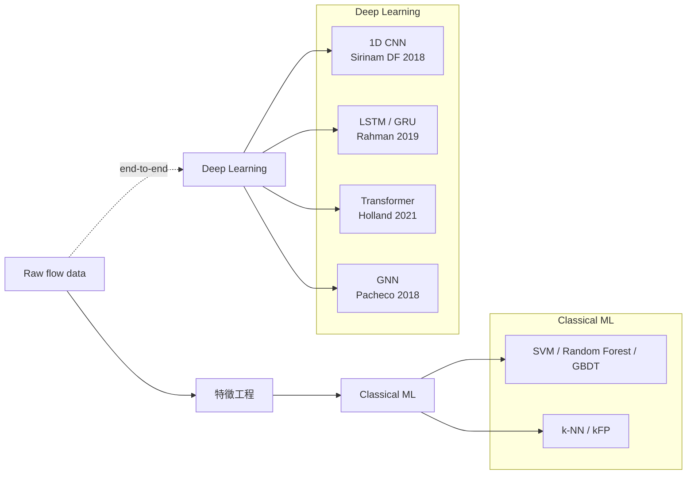

# 課堂 9.8 — 流量指紋與 ML 分類：從 hand-crafted feature 到 deep learning 全綜述

## 學前知道
- 前置課：
  - [9.7 FET detection](./9.7-fully-encrypted-traffic-detection.md)（純被動 byte-level heuristic 已被打）
  - [Part 3.x 資訊熵基礎](../part-3-cryptography/)（KL-divergence、Shannon entropy）
- 預計閱讀時間：**55 分鐘**
- 必讀論文：
  - van Ede et al. *FlowPrint: Semi-Supervised Mobile-App Fingerprinting.* NDSS 2020 → [[vanede-flowprint-ndss20]]
  - Sirinam, Imani, Juarez, Wright. *Deep Fingerprinting.* CCS 2018 → [[sirinam-deep-fingerprinting-ccs18]]
  - Taylor, Spolaor, Conti, Martinovic. *AppScanner.* USENIX Security 2016（supervised baseline）
  - Conti et al. *Robust Smartphone App Identification via Encrypted Network Traffic Analysis.* IEEE TIFS 2016
- 必讀工具源碼：
  - **nDPI**: `https://github.com/ntop/nDPI` — `src/lib/protocols/` 各 protocol 識別器
  - **Zeek**: `https://github.com/zeek/zeek` — `scripts/policy/protocols/` Zeek script 範例
  - **FlowPrint**: `https://github.com/Thijsvanede/FlowPrint`

## 動機

從 lesson 9.7 的 5 條 byte-level heuristic 出發，**「更先進的 detector」** 是什麼？答案：**ML / DL classifier on flow-level features**。

研究級目標：
1. 把流量指紋設計空間徹底拆——hand-crafted feature 譜系、ML model 譜系、defense 譜系。
2. 建立「**對手能力地圖**」：給定 GFW 計算預算 X，他能部署哪一級分類器？
3. 為 lesson 9.13 testbed 建立 baseline——我們會自己訓一個 CNN 對 REALITY 流量做分類。

> **Failure framing**：流量指紋研究是「永遠的兔王賽跑」——攻方加更強 classifier，守方加更強 defense，兩者各有代價（accuracy / overhead）。沒有「完美 defense」。設計協議要承認此事實，給出 **「在 overhead 預算 X 下，可達 indistinguishability bound ε」** 的可量化承諾。

---

## 核心概念

### 1. Feature 譜系：從 packet 到 burst 到 graph

**Layer 0：byte-level**（lesson 9.7 範圍）
- popcount、printable-ratio、known-header-match。
- 適用於：first packet only，stateless。

**Layer 1：packet-level**
- 每 packet 的 `(size, direction, timestamp)`。
- Aggregated: packet-count, bytes-in/out, durations.
- Inter-arrival time (IAT) distribution.
- 適用於：per-flow，need flow assembly。

**Layer 2：record/burst-level**
- 把連續同方向 packet 視為 1 burst。
- Burst sequence: `(burst_size, gap_to_next_burst)`。
- 有時把 TCP record / TLS record 邊界當作 burst 邊界。
- 適用於：TLS-encrypted flows，比 packet-level 更穩定。

**Layer 3：flow-graph level**
- 把多 flow 視為 graph：node = endpoint, edge = flow。
- 對 mobile app 適用（[[vanede-flowprint-ndss20]]）：一個 app 同時連多個 CDN。
- 適用於：multi-flow 場景。

**Layer 4：session/temporal**
- 多個 flow 在 time 上的 correlation。
- Browser open page → 主 HTML flow + 多個 sub-resource flow。
- Proxy traffic 通常 monotonic, browser traffic 分簇。

每升一層，feature richness 增加，但需 **更多 stateful context**——對 GFW line-rate 是 cost。

### 2. Hand-crafted features 經典清單

整理 2010–2018 期間的 WF / 流量分類 feature 集（[[sirinam-deep-fingerprinting-ccs18]] 之前的 baseline）：

| Feature 類 | 具體 metric | 主要文獻 |
|---|---|---|
| Packet size | packet length min/max/mean/std | Liberatore-Levine 2006 |
| Direction | up/down byte ratio | Sun et al. 2002 |
| IAT | inter-arrival time histogram | Wright et al. 2006 |
| Cumulative | cumulative packet count over time | Panchenko CUMUL 2016 |
| Burst | burst size / count | Panchenko 2011 |
| Flow size | total bytes / packets | Wang-Goldberg 2013 |
| TLS record size | first N TLS record sizes | Hintz 2002 |
| Timing | exact timestamps | Wang 2014 (kNN) |

**經典 classifier**：SVM, k-NN, Random Forest, kFP (k-fingerprinting Hayes-Danezis 2016)。

**[[sirinam-deep-fingerprinting-ccs18]] 觀點（CCS 2018）**：所有這些 hand-crafted feature **被 1D CNN 直接從 raw direction sequence 學的 representation 超越**。手工特徵時代結束。

### 3. ML 模型譜系



**每代代表性結果**：

| Model | Closed-world accuracy on Tor | Reference |
|---|---|---|
| k-NN | 91 % | Wang et al. USENIX 2014 |
| CUMUL | 91 % | Panchenko USENIX 2016 |
| kFP | 96 % | Hayes-Danezis USENIX Security 2016 |
| DF (1D CNN) | 98 % | [[sirinam-deep-fingerprinting-ccs18]] |
| Tik-Tok (timing-aware) | 98.5 % | Rahman PoPETs 2019 |
| Var-CNN | 98 % | Bhat 2019 |
| RF + ATT (Awsome-WF) | 98.6 % | Yin 2021 |
| GANDaLF (semi-supervised) | 78 % from 20 traces/class | Oh et al. NDSS 2021 |

**Open-world**（包含 unseen sites）：DF 0.99 precision / 0.94 recall（[[sirinam-deep-fingerprinting-ccs18]]）。

### 4. FlowPrint 的特殊角度：semi-supervised

[[vanede-flowprint-ndss20]] 的貢獻不是「最高 accuracy」而是 **「不需要 per-app label」**：

- 把 destination IP + TLS SNI + cert 當作 cluster key。
- 同一 device、同一時間窗、同一 cluster → 推測為同一 app。
- 89.2 % closed-world、93.5 % precision on unseen apps。

**對 GFW 的意義**：GFW 不太需要區分具體 app（是 Twitter 還是 Facebook），但需要區分 **「VPN/proxy app」vs「browser/normal app」**。FlowPrint 提供方法：
- 一個用 SS 翻牆的設備，所有流量都連 1 個 destination IP（SS server）→ FlowPrint 會把它聚類到單一 cluster → 與「正常多 destination browsing」分開 → 可疑。
- 對策（lesson 10.5 詳）：cover traffic、multi-server、refraction networking。

### 5. nDPI / Zeek：工程界的「ML」

實務上，GFW 大概率不是直接跑 DL classifier，而是 **nDPI / Zeek 風格的 rule-based + statistical + simple ML pipeline**。

**nDPI**：
- 開源 DPI 庫，識別 ~280 種 protocol。
- 每 protocol 一個 detector（C 程式碼）：`src/lib/protocols/<protocol>.c`。
- 識別策略：
  - Plaintext signature（HTTP `GET`、SSH banner）
  - TLS SNI 比對黑名單
  - QUIC version + DCID parser
  - Statistical features（packet size distribution）
- 對 SS / VMess / Trojan / VLESS 沒有專門 detector（截至 2026-05），但有 "fully-encrypted protocol" generic detector。

**Zeek**（formerly Bro）：
- network analysis framework + scripting language。
- 用於企業 NIDS。
- Script 可寫 stateful flow logic。例：
  ```zeek
  event ssl_client_hello(c: connection, version: count, possible_ts: time,
                          client_random: string, session_id: string,
                          ciphers: index_vec, extensions: index_vec)
  {
      if ( /badsni/ in c$ssl$server_name )
          Log::write(...);
  }
  ```

**GFW 內部可能用什麼**：無公開 evidence。Plausible：自寫 line-rate DPI + 部分 Zeek-style stateful logic + ML 補強。

### 6. Defense 譜系（lesson 10.x 詳，這裡 preview）

**Layer 0：none**（vanilla SS、VMess）→ 任何分類器都 work。

**Layer 1：cover protocol mimicry**（Trojan、REALITY）→ defeat byte-level；但 traffic-shape 仍可分。

**Layer 2：constant-rate padding**（FRONT-PAD、TAMARAW、CS-BuFLO）→ 流量被填充到固定 rate；bandwidth overhead 通常 50-200 %。

**Layer 3：traffic shaping**（Walkie-Talkie burst molding、HORDE morphing）→ 主動模仿 cover protocol 的 packet pattern；bandwidth overhead lower (10-30 %)，但實作複雜。

**Layer 4：cover traffic / decoy**（Conjure、Refraction）→ 與真實流量混合；架構依賴 ISP/CDN 合作。

**Layer 5：adversarial training / formal indistinguishability**（lesson 10.4）→ 設計流量 explicitly 對抗 DL classifier。

### 7. GFW 的可能 ML 部署：推測

到 2026-05 沒有 GFW 部署 ML classifier 對 REALITY 的 evidence。但 plausible 部署：

**Stage 1（已部署）**：byte-level heuristic（[[wu-fep-detection]]）。

**Stage 2（懷疑部署）**：simple statistical classifier on first N packet sizes + IAT。對 REALITY traffic vs browser traffic 可區分。但目前的「軟報導」（GFW Report blog）未確認。

**Stage 3（預估 2026-2028）**：1D CNN per flow，line-rate inference。硬體成本：每 inference 需 ~ms（CPU）或 ~μs（GPU）。對 GFW Tbps 流量，需要 ~10^4 GPUs——可行但昂貴。**部分流量 sample-and-deep-inspect 是 more realistic**。

**Stage 4（推測 2030+）**：transformer per flow + cross-flow correlation。

---

## 與我們協議設計的關聯

從 ML 攻防全景對我們協議的約束：

1. **不能只 evade Stage 1**（[[wu-fep-detection]]）。必須對 Stage 2 也有抵抗——意味著 packet size / IAT 統計分布要 plausible。
2. **首選 Stage 3 抵抗** 是 cover traffic / morphing / padding。Bandwidth overhead 5-30 % 是可接受成本。
3. **不要 over-engineer 對抗 Stage 4**——還沒到。但留 protocol extension point 讓未來升級。
4. **Multi-flow correlation**：proxy 流量單 destination 是弱點。我們可考慮 multi-destination（用 N 個 server 同時連，按 H/3 multipath 方式 ramble）。

Part 10 整段是「**traffic analysis defense**」，Part 11.7 整合到我們協議的具體機制。

---

## 動手

**任務**：用 FlowPrint + DF 對你的真實 outbound 流量做分類測試。

### Setup
1. 在你的 macOS / Linux 上同時 capture：
   - 30 分鐘 normal Chrome browsing。
   - 30 分鐘 VLESS+REALITY tunnel 下 Chrome browsing。
   - 30 分鐘 Hysteria2 tunnel 下 Chrome browsing。
2. 用 `tcpdump -i any -w trace.pcap` 抓全部，後面用 Python/Scapy 分流。

### FlowPrint 實驗
3. 把 trace 餵 FlowPrint：
   ```bash
   pip install flowprint
   python -m flowprint --pcap trace.pcap --output flowprint-result.json
   ```
4. 看 FlowPrint 把你的 traffic 聚到幾個 cluster？分得開 normal vs tunneled？

### DF 實驗（簡化版）
5. 從 trace 提取 `(direction, size)` sequence，每 flow first 5000 packets。
6. 訓 1D CNN（用 PyTorch）做 binary classification：is_proxied vs not_proxied。
7. 80/20 train/test split，看 closed-world accuracy。

### 預期觀察
- FlowPrint：把所有 tunneled traffic 聚到 1 cluster（因為 destination 都是同一 IP）→ 很容易與 normal 區分。
- DF：accuracy 預期 90 %+。即使 REALITY 包了 TLS layer，packet size 與 timing pattern 仍洩漏。

**輸出**：`assets/code/wf-baseline/`，含 README + Jupyter notebook + 訓練好的 model 與 metrics。

---

## 自我檢查

1. 為何 [[sirinam-deep-fingerprinting-ccs18]] 用 1D CNN 而不是 RNN？1D CNN 對 packet sequence 有何天然優勢？
2. FlowPrint 對 single-destination proxy traffic 的「破解」原理是什麼？我們協議如何 mitigate？
3. 在 nDPI 中加一個 detector 識別 SS-2022 with HTTP prefix。它能 catch 什麼、漏掉什麼？
4. 對手部署 1D CNN，inference 成本約 ~1 ms/flow。Tbps 流量約 100 Gbps × 1 Mflows/s。對手需多少 GPU？這個 cost 對 GFW 來說是 budget 問題還是 fundamental 問題？
5. 估計：constant-rate padding 把 REALITY traffic 變成「100 KB/s 上行 + 1 MB/s 下行」之類，能 defeat DF 嗎？bandwidth overhead 估算。
6. Multi-flow correlation defence 的 trade-off：什麼情境下 multi-server proxy 反而暴露身份？

---

## 延伸閱讀

- Liberatore, M., Levine, B. *Inferring the source of encrypted HTTP connections.* CCS 2006（WF 起源）
- Wang, T., Goldberg, I. *Improved website fingerprinting on Tor.* WPES 2013
- Bhat et al. *Var-CNN.* PoPETs 2019
- Oh et al. *GANDaLF.* NDSS 2021
- Holland et al. *New Directions in Automated Traffic Analysis.* CCS 2021
- nDPI documentation: `https://www.ntop.org/products/deep-packet-inspection/ndpi/`
- Zeek docs: `https://docs.zeek.org`

---

## 研究級補遺

### 1. 學界詞彙

| 中文 | 學界標準 | 說明 |
|---|---|---|
| 流量指紋 | **traffic fingerprint** | (size, timing, direction) statistical profile |
| 網頁指紋 | **website fingerprinting (WF)** | 對 Tor 等識別具體 site |
| 應用指紋 | **app fingerprinting** | 識別具體 app（FlowPrint） |
| 端到端深度學習 | **end-to-end DL** | 不做 feature engineering |
| 封閉/開放世界 | **closed-/open-world** | classifier 是否能拒絕 unseen class |
| 流量整形 | **traffic shaping** | 主動改變流量 statistical profile |
| 對抗式樣本 | **adversarial example** | 在流量上構造 evade classifier 的 perturbation |

### 2. 對手分類學精化

GFW 在 ML 維度的對手分類：
- **Capability tier 1**（已部署）: byte-level heuristic
- **Tier 2**（懷疑部署）: simple statistical classifier
- **Tier 3**（預估 2026-2028）: 1D CNN line-rate
- **Tier 4**（推測 2030+）: transformer + multi-flow

**Computational budget**：line-rate ML inference 成本高，必然 **sample-based**。對 single suspect IP 全 flow inference 可行。

### 3. 形式化定義

**Traffic indistinguishability**：

對 PPT 對手 $\mathcal{A}$（含 ML model），給定 flow $f$：

$$
\mathsf{Adv}^{\mathsf{TA}}_{\mathcal{A}}(\kappa) = \Pr[\mathcal{A}(f) = 1 | f \sim \Pi] - \Pr[\mathcal{A}(f) = 1 | f \sim \text{Cover}]
$$

協議 $\Pi$ 是 $(T, \epsilon)$-TA-secure iff 對任意 runtime $T(\kappa)$ 的 $\mathcal{A}$：$\mathsf{Adv} \leq \epsilon$。

問題：**沒有任何已部署協議能對 $T(\kappa) = $ polynomial 級對手達 $\epsilon \approx 0$**。Walkie-Talkie 接近，但帶寬代價巨大。

### 4. 我們協議的座標

| Part 11 子節 | 應用 |
|---|---|
| 11.7 traffic-shape defense | 必含 light padding + pacing |
| 11.8 ML-resistance | 對 1D CNN 級 classifier 評估，目標 $\epsilon \leq 0.2$ |
| 11.12 evaluation | 復現 DF 作 baseline classifier |

### 5. 必追資源

- WF benchmarks: `https://github.com/website-fingerprinting/wfdef`
- AwfPy / TF-WF / DeepCoffea (timing-aware) — 最新攻擊
- nDPI source + documentation
- Zeek's `analyzer/protocol/ssl/` for TLS analysis

### 6. 開放問題

1. **Cover traffic 的最小 overhead** 對 1D CNN $\epsilon \leq 0.1$ 是多少？目前最好 ~100 % bandwidth (Walkie-Talkie)。能否更低？
2. **Multi-flow rampling**：用 N 個 server 分散流量，**鋸齒 timing**，能否 break correlation classifier？
3. **GAN-trained morphing**：用 GAN 自動生成 cover-mimicking traffic，是否真能 generalize?
4. **Server-side morphing**：服務器主動 reshape traffic 比 client-side easier（避免 cross-NAT 的 timing 漂移）。能否設計協議讓 server-side 完成大部分 morphing？
