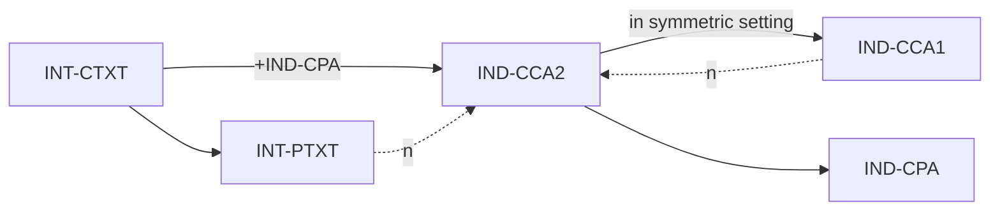

# Authenticated Encryption: Relations among Notions and Analysis of the Generic Composition Paradigm
**Venue / Year**: ASIACRYPT 2000（journal 版 Journal of Cryptology 2008，IACR ePrint 2000/025）
**Authors**: Mihir Bellare, Chanathip Namprempre
**Read on**: 2026-05-14 (in lesson 3.1)
**Status**: full PDF (`assets/papers/bellare-namprempre-2000.pdf`)
**One-line**: 證明「Encrypt-then-MAC 是泛用安全（generically IND-CCA2 + INT-CTXT）」的權威結果，反證 SSL 用的 MAC-then-Encrypt 與 SSH 用的 Encrypt-and-MAC 都不是泛用安全——這是現代 AEAD 設計的理論起點。

## Problem
1990 年代主流安全通道協議（SSL/TLS、IPsec、SSH）各自選了一種 encryption + MAC 的組合方式：
- **SSL/TLS**：MAC-then-Encrypt (MtE)：a = MAC(x); C = Enc(x ‖ a)
- **IPsec ESP**：Encrypt-then-MAC (EtM)：C = Enc(x); a = MAC(C); send (C, a)
- **SSH**：Encrypt-and-MAC (E&M)：C = Enc(x); a = MAC(x); send (C, a)

三家三套，誰對？社群只是直覺挑——沒有 formal answer。

## Contribution
論文同時做兩件事：

### 1. Relations among notions
證明四個 notion 的 implication 關係：



關鍵 implication：**INT-CTXT + IND-CPA ⇒ IND-CCA2**。意義：要證明你的 AEAD 是 IND-CCA2-secure，**只要分別**證明它「IND-CPA」加「INT-CTXT」即可。這把證明複雜度大幅降低。

### 2. Analysis of generic composition

| 組合 | 給定 IND-CPA Enc + sUF-CMA MAC，能保證... | 反例 |
|---|---|---|
| **EtM** Encrypt-then-MAC | ✅ IND-CCA2 + INT-CTXT （**generically secure**） | — |
| **MtE** MAC-then-Encrypt | ❌ generically 不保證 IND-CCA2，也不保證 INT-CTXT | 構造一個「IND-CPA-secure 但合成後 IND-CCA2-broken」的 Enc |
| **E&M** Encrypt-and-MAC | ❌ 連 IND-CPA 都失去（MAC 可能洩 plaintext equality） | MAC of plaintext is deterministic ⇒ same plaintext ⇒ same MAC |

**這就是為什麼 GCM、ChaCha20-Poly1305、AES-OCB 全是 EtM 變形**。SSL 3.0 / TLS 1.0 / 1.1 / 1.2（CBC mode）的 MtE 設計是錯的——只是因為底層 CBC 剛好是 randomized + length-preserving，才**碰巧**沒 catastrophic failure（直到 BEAST、Lucky 13、POODLE 把這個 luck 戳穿）。

## Method (just enough to reproduce mentally)
**主定理（EtM）的證明骨架**：

假設對 EtM scheme 存在 PPT 對手 A 達到 IND-CCA2 advantage ε。我們構造 reductions B_1（攻擊 Enc 的 IND-CPA）、B_2（攻擊 MAC 的 sUF-CMA），使：

```text
ε = Adv^IND-CCA2_EtM(A) ≤ Adv^IND-CPA_Enc(B_1) + Adv^sUF-CMA_MAC(B_2) + q_d / 2^τ
```

其中 q_d = decryption query 數，τ = MAC tag 長度。

**證明 trick**：B_2 截聽 A 對 Dec oracle 的 query。任何 valid (C, a) query 必須有 valid MAC tag a on C；若 (C, a) 不在 A 之前 enc query 結果中，則 (C, a) 是 MAC 偽造 → B_2 用它打 MAC sUF-CMA。否則 Dec 對 B_1 透明（B_1 知道對應的 plaintext）。

**反例構造**（MtE 不安全）：取一個 IND-CPA-secure stream cipher Enc（例如 OTP-style with random pad），對任意 m，C = m ⊕ K。MtE 把 (m ‖ MAC(m)) 加密。對手在 IND-CCA2 game 中拿到 challenge C\*，flip 一個 bit 在 ciphertext payload 部分得 C'，送 Dec(C')。Dec 解出 (m' ‖ a')，發現 MAC verify 失敗 → 回 ⊥。但**錯誤訊息的時序**洩露 padding/MAC 哪個先 fail——這就是 padding oracle 的根。

## Results
- 直接導致 TLS 1.3 (RFC 8446) **完全廢除 MtE**，全用 AEAD（即 EtM 的 inline 形式）。
- IPSec ESP 改 spec 強制 EtM（早期允許 E&M 與 MtE）。
- SSH 從 v2.0 開始也加入 EtM 模式（OpenSSH `*-etm@openssh.com` ciphers）。
- 為 NIST 推 GCM、ChaCha20-Poly1305 上標準提供理論依據（兩者都是 EtM 變形）。

## Limitations / what they don't solve
- 只處理「黑盒 generic composition」。具體某個 MtE 實作可能仍安全（如 Krawczyk 2001 證明 SSL 的 MtE+CBC+stream cipher 在特定條件下安全）。
- 不處理 nonce-misuse。對手在 EtM 下若能 reuse nonce 仍會壞（GCM 一次 reuse → 完整 plaintext 洩露 + key recovery via 內部 Galois multiplier）。
- 不處理 length-hiding。Length leakage 是另一條 attack surface（compression attacks: CRIME, BREACH）。

## How it informs our protocol design
- **Proteus record layer 一定 EtM / AEAD**：直接採用 ChaCha20-Poly1305 (RFC 8439) 或 AES-256-GCM。
- **Proteus spec 必須寫 nonce uniqueness invariant**：每 (key, nonce) 對只能用一次；建議 nonce = epoch ‖ counter。
- **Proteus spec 必須證明 IND-CCA2**：用本論文主定理的「IND-CPA + INT-CTXT ⇒ IND-CCA2」reduce 到 ChaCha20 的 PRF security + Poly1305 的 ε-AXU bound。

## Open questions
- Multi-user multi-instance 下 EtM 的 tight bound？Bellare-Bernstein-Tessaro 2016 仍是當前最強，但 ChaCha20-Poly1305 在 millions of users 下仍 open。
- Quantum CCA security of EtM？Boneh-Zhandry 2013 給了 framework，具體 EtM scheme 的 quantum bound 仍 active。

## References worth following
- Krawczyk *The Order of Encryption and Authentication* (CRYPTO 2001) — MtE 在何種條件下偶然安全的 case-by-case 分析。
- Rogaway *Nonce-Based Symmetric Encryption* (FSE 2004) — 把 nonce 從 randomness 解放出來的 framework。
- Hoang, Krovetz, Rogaway *Robust Authenticated-Encryption AEZ* (EUROCRYPT 2015) — misuse-resistant AE。
- McGrew, Viega *The Galois/Counter Mode of Operation (GCM)* (NIST 2004) — GCM 是 EtM 的 inline 形式。
