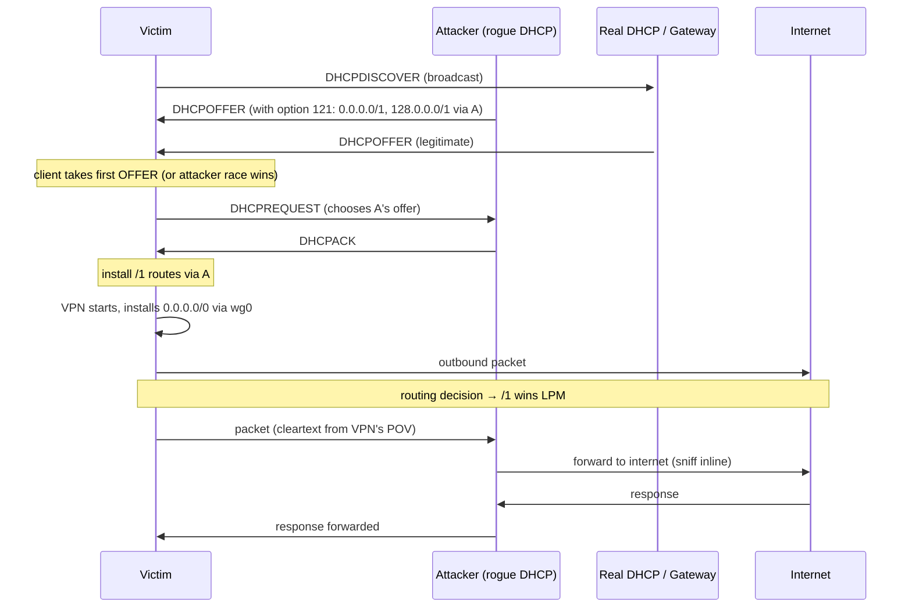

# TunnelVision (CVE-2024-3661): Decloaking Routing-Based VPNs via DHCP Option 121

**Venue / Year**: Leviathan Security Group public disclosure, 2024-05-06. NIST NVD CVE-2024-3661, CVSS 7.6. No peer-reviewed publication (disclosure blog post is canonical).
**Authors**: Dani Cronce, Lizzie Moratti (Leviathan Security Group)
**Read on**: 2026-05-14（in lesson [1.5 ARP / NDP / DHCP](../../lessons/part-1-networking/1.5-arp-ndp-dhcp.md)）
**Status**: Disclosure blog + NIST advisory + Hacker News + multi-vendor advisory cross-confirmed. Technical mechanism fully documented across sources; no PDF / academic paper exists (this is industry disclosure, not academic publication).
**One-line**: 攻擊者在 victim 同 LAN 跑 rogue DHCP server 推 option 121（classless static route）注入 `0.0.0.0/1` 與 `128.0.0.0/1` 兩條 /1 路由，**LPM 規則自動勝過 VPN 的 /0 default route**，使所有 IPv4 流量在 OS routing layer 被攔截，**VPN tunnel 仍 up 但無流量經過**——影響所有 routing-based VPN（WireGuard、OpenVPN、IPsec、Tailscale），唯一免疫 OS 是 Android（從未實作 option 121）。

## Problem

當代 VPN（WireGuard、OpenVPN、IPsec、commercial VPN clients）底層普遍依賴「**在 OS routing table 加 `0.0.0.0/0 dev wg0` 搶 default route**」這個 mechanism——OS 看到 default 指向 VPN interface，把所有未路由的 packet 送進 tunnel。

**設計假設**：「沒有比 /0 更長 prefix 的 route 存在於 OS routing table。」

**現實**：DHCP option 121（RFC 3442, 2002）讓 DHCP server 可以推任意 (prefix, length, next-hop) 到 client，**包括 longer-than-zero prefix**。**這個 feature 從未被視為威脅**——因為「DHCP server 是 LAN admin，是可信的」。

但在咖啡店 / 飯店 / 機場 / 共享辦公室 WiFi 場景，**「DHCP server 可信」這個前提不成立**。**任何 LAN 同網對手都可能成為 rogue DHCP server**。

## Contribution

提出並 PoC 證實的攻擊技術：

1. **取得 DHCP server 地位**（同 LAN 對手能做的事）：
   - **DHCP starvation**：用偽造 client identifier 耗盡合法 server 的 IP pool
   - **Race condition**：DHCP DISCOVER 是 broadcast，攻擊者監聽到後**比合法 server 更快回 OFFER**（client 接受第一個 OFFER）
   - **ARP spoofing**：偽裝成合法 DHCP server 的 IP，攔截 client 與真 server 的後續對話

2. **構造 evil OFFER**，內含 option 121：
   ```
   Option 121 classless static route:
     0.0.0.0/1   → next-hop attacker_IP
     128.0.0.0/1 → next-hop attacker_IP
   ```
   兩條 /1 路由聯合覆蓋整個 IPv4 地址空間，prefix length 1 > VPN 的 0 → **LPM 永遠選 /1 entries**。

3. **設定攻擊者主機作 forwarder**：把收到的 packet forward 給真 internet（保持「網路通」假象，避免 victim 察覺異常）+ 同時側錄。

4. **VPN tunnel 仍存在**但**無流量經過**：
   - VPN client 看 wg0 up、handshake OK、heartbeat OK
   - OS routing layer 在 packet 進 wg0 之前就攔截走 /1 path
   - **VPN application 層完全感知不到**——它看不到 routing table

## Method (just enough to reproduce mentally)

#### Attack flow



#### 為什麼 /1 路由不需 unset VPN's /0

LPM 規則：對 dst IP `D`，選 **prefix length 最長的 matching entry**。
- `0.0.0.0/0` matches everything (length 0)
- `0.0.0.0/1` matches `0.0.0.0` to `127.255.255.255` (length 1)
- `128.0.0.0/1` matches `128.0.0.0` to `255.255.255.255` (length 1)

兩條 /1 聯合覆蓋整個 IPv4，且**比 /0 長 1 bit**。⇒ LPM 永遠選 /1，VPN 的 /0 純粹被「shadow」。

#### 為什麼 application layer 感知不到

OS routing table 在 IP layer 被查詢，先於任何 user-space VPN client 邏輯。WireGuard / OpenVPN 看不到 routing decision——他們只看到「**有 packet 進入 wg0**」這個事件，但**沒有 packet 進來**（因為 routing 把 packet 送去別處）。

VPN 的 tunnel control plane（handshake、keep-alive）走自己已建立的 socket，可能不受影響或受影響——但 user 的 application traffic 全部洩漏。

## Results

#### 影響範圍

| OS | option 121 支援 | 受影響 |
|---|---|---|
| Windows 7~11 | ✅ | ✅ |
| macOS / iOS | ✅ | ✅ |
| Linux (NetworkManager, dhclient) | ✅ | ✅ |
| **Android** | ❌（從未實作） | ❌（意外免疫） |
| ChromeOS | 部分 | 部分 |
| FreeBSD / OpenBSD | 視 dhclient 版本 | 大多受影響 |

#### VPN 供應商反應（disclosure 後 4 週內）

- **Mullvad（桌面）**：firewall rules 已擋（killswitch via nftables 限定流量出 wg interface）⇒ 不受影響；**iOS 版受影響**已修
- **ProtonVPN / NordVPN / ExpressVPN / Surfshark**：發 advisory，多數補 firewall-based killswitch
- **WireGuard 官方**：確認該 mechanism 不屬 WireGuard 本身漏洞（OS 路由層問題）；建議 namespace 隔離
- **Fortinet / Zscaler / Cisco AnyConnect**：各自的 enterprise client 補丁，主要走 firewall rules

#### 觀察到的「intended TLS 流量未受重大影響」

- 多數現代流量 TLS 加密，攻擊者只能看 metadata（IP、port、SNI），無法解密應用 payload
- 但 **metadata 對審查很有用**：GFW-class adversary 可在 LAN 級就拿到「victim 連哪些 IP / domain」資訊，**不需 ISP 配合**

## Limitations / what they don't solve

#### 攻擊面限制

1. **必須在同 LAN**——遠端 internet 對手做不到（不過遠端可控制 client 連的 WiFi 設備時等價）
2. **TLS 加密的 payload 仍受保護**——但 SNI / metadata 洩漏
3. **某些 firewall-based killswitch 可緩解**——但若 firewall rule 在 VPN 起來之後才 install 有 race window
4. **Android 免疫**（option 121 未實作）但**亦因此犧牲企業 enterprise 部署能力**

#### 緩解手段限制

| 緩解 | 限制 |
|---|---|
| **Network namespace** | Linux only；macOS/Windows/iOS 無對等機制 |
| **Firewall killswitch** | 必須在 VPN 起來前 install；安裝順序 race；reboot/sleep 邊界仍漏 |
| **DHCP snooping on switch** | 必須有 manageable LAN——公共 WiFi 做不到 |
| **拒收 option 121** | 破壞合法 enterprise 用例 |
| **Hotspot mode** | 行動 device battery / cellular data 消耗大 |
| **VPN 內 traffic 也 firewall** | 增加部署複雜度；client 端 OS API 不一致 |

#### 不解決的更大問題

- **DHCP 本身無認證**——TunnelVision 只是 option 121 一個 attack vector。**option 6 (DNS injection)、option 252 (WPAD)、option 114 (captive portal URL spoofing)** 全都類似可被濫用
- **VPN 設計依賴 OS routing 的 architectural 缺陷**——TunnelVision 揭露這個 architectural 假設不安全，**所有依此設計的 VPN 都需 redesign**

## How it informs our protocol design

對 Proteus 的硬性影響：

1. **Proteus client 不能用 routing table mechanism 做 traffic capture**——必須走 socket-layer interception（user-space proxy）或 explicit netns
2. **Killswitch 必須在 Proteus server 連線建立前 install**——順序：先 firewall lockdown → 再 Proteus control channel → 再 data plane
3. **Threat model 必須列入「同 LAN 對手」** 為 first-class（不是「邊緣場景」）
4. **Proteus client 啟動流程加入 rogue DHCP detection**：sample 多次 DHCP options，異常值 → 警告或拒連
5. **「應用層 TLS 加密」不是充足保護**——SNI 與 IP-level metadata 對 censorship 對手仍有價值，**Proteus 必須在 IP/transport 層做 obfuscation**（不僅僅是應用 payload 加密）

#### 架構選擇對比

| VPN 設計範式 | TunnelVision 暴露的問題 | Proteus 設計選擇 |
|---|---|---|
| **依賴 OS routing**（WireGuard、IPsec tunnel mode） | 嚴重漏 | **不採用**作為 Proteus baseline |
| **socket-layer proxy**（Shadowsocks、V2Ray、sing-box） | 不受影響（沒搶 default route） | **Proteus baseline 採用** |
| **netns 隔離**（手動 wireguard-go in netns） | 不受影響 | Proteus 可選增強 |
| **VPN extension API**（iOS Network Extension、Android VpnService） | OS 內建保護優於 generic routing-VPN | 行動 client 採用 |

## Open questions

- **VPN 提供商應該 mandatory 實作 killswitch 嗎**？目前是 opt-in，多數 user 沒開——是否該變預設？UX trade-off
- **Android 拒實作 option 121 的代價**：企業 VPN 部署在 Android 上常需 split-tunnel 路由——這部分用戶要怎麼辦？
- **DHCP 認證有 path 嗎**？RFC 3118 (Authentication for DHCP messages) 提了 pre-shared key 機制，**幾乎零部署**——為什麼？是否 PKI 化的 DHCP（基於 RPKI 之類的 trust anchor）可行？
- **OS-level VPN trust mechanism 怎麼設計**：目前 iOS NE、Android VpnService 是 OS-mediated VPN extension，但 Linux/Windows/macOS 仍走 routing-VPN。**統一 OS API** 是 IETF / OS vendor 該推的方向
- **TunnelVision 之後類似漏洞還會出**：DHCP option 表內 100+ 個選項，**還沒系統性 audit 哪些可被 weaponize**——這是現成的 SoK paper 機會
- **Censorship perspective**：TunnelVision 提供 GFW 級對手「**不需要 ISP 配合就能在邊緣 LAN 級看到 VPN 用戶的 metadata**」的能力——這對 censorship 研究有顯著意義

## References worth following

- **Leviathan Security TunnelVision disclosure** <https://www.leviathansecurity.com/blog/tunnelvision>
- **NIST NVD CVE-2024-3661** <https://nvd.nist.gov/vuln/detail/CVE-2024-3661>
- **Vanhoef 2023 TunnelCrack** (USENIX Security)——VPN 路由洩漏相關但 distinct attacks
- **RFC 3442** Classless Static Route option 原文
- **RFC 8415** DHCPv6 整合版（含 reconfigure auth 設計）
- **Mullvad 2024 blog**: how their desktop killswitch prevents TunnelVision
- **Apple, Microsoft, Google 各自 advisory**（多數有 internal CVE 對應，搜 KB 文章）
- **WireGuard official statement**（official mailing list 2024-05-07）
