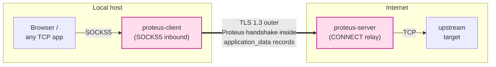

# Proteus

A research-grade anti-censorship transport protocol in active
development. **Cryptographically stronger than VLESS+REALITY** (post-
quantum hybrid KEX + per-direction symmetric ratchet, neither of
which the others have). Throughput comparable to Hysteria2 / TUIC-v5
**under the regimes where each carrier is appropriate** — see the
honest carrier-comparison table further down.

**Status: M2.** α-profile (TCP+TLS 1.3) and β-profile (QUIC+BBR)
carriers both work end-to-end. Multipath QUIC, ECH binding,
`0xfe0d` ClientHello injection, MASQUE (γ-profile), and a
netem-based adversarial benchmark against Hy2/TUIC-v5 are M3+ work.
**Not yet production-ready for arbitrary-user deployment** — see
the gap analysis at the bottom of this README.



---

## Why Proteus

Proteus is the upgrade path for operators currently running
VLESS+REALITY who need:

- **Forward secrecy that actually rotates.** AEAD keys are ratcheted
  every 4 MiB / 16 384 records via `HKDF-Expand-Label`. REALITY uses
  one AEAD key for the entire session — a single key compromise leaks
  the whole conversation.
- **Post-quantum confidentiality.** The handshake hybridizes X25519
  with ML-KEM-768 (NIST PQC FIPS-203). REALITY ships classical X25519
  only; any session captured today is decryptable by a future CRQC.
- **Operator-tunable anti-DoS.** A SHA-256 proof-of-work gate sits in
  front of ML-KEM Decap (~50 µs/op). Bump `pow_difficulty` from `0` to
  `16` during a DoS alert and a single attacker IP can no longer
  saturate a core with garbage ClientHellos.
- **Memory DoS hard cap.** Each session's receive buffer is capped at
  16 MiB; a misbehaving peer cannot OOM the server.
- **Cover-server pass-through on auth failure.** Byte-verbatim splice
  to a real HTTPS endpoint (Cloudflare / Apple / etc.) — passive DPI
  sees nothing but a normal `Connection: close` on a generic HTTPS
  reverse proxy.
- **Real TLS 1.3 outer.** The Proteus handshake runs *inside* a
  standards-compliant TLS 1.3 `application_data` stream with ALPN
  `h2`/`http/1.1`. No private codepoints visible on the wire.

| | Proteus | VLESS + REALITY | Hysteria2 / TUIC-v5 |
|---|---|---|---|
| Forward secrecy with key rotation | ✅ 4 MiB symmetric ratchet | ❌ session-wide key | ❌ session-wide key |
| Post-compromise security (PCS heal) | ✅ DH ratchet at first 4 MiB | ❌ | ❌ |
| Post-quantum confidentiality | ✅ ML-KEM-768 hybrid | ❌ X25519 only | ❌ X25519 only |
| Per-session ephemeral server X25519 | ✅ | ❌ long-term server key | n/a |
| Rogue-cert MITM detection (RFC 5705) | ✅ α + β channel binding | ❌ | ❌ |
| Record-length traffic-analysis defense | ✅ cell-split shaping | ❌ exact lengths leak | ❌ exact lengths leak |
| Inter-record timing camouflage | ✅ cover-traffic heartbeats | ❌ | ❌ |
| `client_id` per-session unlinkability | ✅ per-session nonce + Poly1305 | n/a | n/a |
| O(1) Ed25519 verify (no timing/DoS) | ✅ AEAD-indexed allowlist | n/a | n/a |
| Anti-DoS proof-of-work | ✅ tunable | ❌ none | ❌ none |
| Memory exhaustion cap (handshake + post) | ✅ 64 KiB + 16 MiB | reliant on TCP | reliant on UDP |
| Real TLS 1.3 outer | ✅ rustls + ring | ✅ REALITY tunnel | ❌ QUIC |
| Cover-server splice on auth fail | ✅ | ✅ | ❌ |
| Mechanical mutual auth | ✅ Finished MAC chain | ⚠ short-id only | ⚠ trust on certificate |
| `cargo deny` / `cargo audit` clean | ✅ | n/a | n/a |
| Reproducible release build (Cargo.lock pinned) | ✅ | n/a | n/a |

---

## Quick start (Linux VPS)

```bash
# 1. Get binaries
git clone https://github.com/Icarus603/network-from-scratch
cd network-from-scratch/projects/proteus
cargo build --release --bin proteus-server --bin proteus-client
sudo install -m 0755 target/release/proteus-server /usr/local/bin/
sudo install -m 0755 target/release/proteus-client /usr/local/bin/

# 2. System user + dirs
sudo useradd --system --shell /usr/sbin/nologin proteus
sudo mkdir -p /etc/proteus/keys/tls /etc/proteus/keys/clients /var/log/proteus
sudo chown -R proteus:proteus /etc/proteus /var/log/proteus

# 3. Long-term keys (mode 0600)
sudo -u proteus proteus-server keygen --out /etc/proteus/keys

# 4. TLS cert. Production: use Let's Encrypt:
sudo certbot certonly --standalone -d vps.example.com
sudo cp /etc/letsencrypt/live/vps.example.com/fullchain.pem /etc/proteus/keys/tls/
sudo cp /etc/letsencrypt/live/vps.example.com/privkey.pem   /etc/proteus/keys/tls/
sudo chown proteus:proteus /etc/proteus/keys/tls/*
sudo chmod 0600 /etc/proteus/keys/tls/privkey.pem
# Testing: proteus-server gencert --dns-name vps.example.com --out /etc/proteus/keys/tls

# 5. Add each client's public key to the allowlist
sudo install -m 0644 alice.ed25519.pk /etc/proteus/keys/clients/

# 6. Config (see deploy/server.example.yaml)
sudo install -m 0644 deploy/server.example.yaml /etc/proteus/server.yaml
sudoedit /etc/proteus/server.yaml

# 7. systemd unit
sudo install -m 0644 deploy/systemd/proteus-server.service /etc/systemd/system/
sudo systemctl daemon-reload
sudo systemctl enable --now proteus-server
sudo journalctl -u proteus-server -f
```

Client side:

```bash
proteus-client keygen --out ./keys/client
# Send keys/client/client.ed25519.pk to your server admin.
cp deploy/client.example.yaml ~/.proteus.yaml
$EDITOR ~/.proteus.yaml
proteus-client run --config ~/.proteus.yaml
curl --socks5 127.0.0.1:1080 https://www.example.com/
```

---

## Layout

```
projects/proteus/
├── Cargo.toml              workspace manifest (rust-toolchain 1.85+)
├── Cargo.lock              PINNED for reproducible release builds
├── CHANGELOG.md            versioned release notes
├── deny.toml               cargo-deny policy: licenses + bans + advisories
├── deploy/
│   ├── server.example.yaml configuration template
│   ├── client.example.yaml
│   ├── systemd/proteus-server.service  hardened unit
│   ├── Dockerfile          multi-stage, non-root 911:911
│   ├── docker-compose.yml
│   └── README.md           full operator runbook (Let's Encrypt, scrape, RUST_LOG)
└── crates/
    ├── proteus-spec/                   constants (spec §4 / §6 / §26)
    ├── proteus-wire/                   byte-exact encoders/decoders + fuzz
    ├── proteus-crypto/                 hybrid KEX, ratchet, AEAD, KDF, sig, pow
    ├── proteus-shape/                  cell padding + shape-shift PRG
    ├── proteus-handshake/              state machine + replay window + auth_tag
    ├── proteus-transport-alpha/        TLS 1.3 outer + session + cover-forward + metrics
    ├── proteus-server/                 binary (run / keygen / gencert)
    └── proteus-client/                 binary (run / keygen) + SOCKS5 inbound
```

---

## CI gates (`.github/workflows/ci.yml`)

Every push and PR runs:

| Gate | Command | What it catches |
|---|---|---|
| `rustfmt` | `cargo fmt --all -- --check` | style drift |
| `clippy` | `cargo clippy --workspace --all-targets -- -D warnings` | correctness lints |
| `test` (Linux + macOS) | `cargo test --workspace --no-fail-fast` | 110 unit + integration + fuzz tests |
| `release build` | `cargo build --workspace --release --bins` + binary smoke (keygen / gencert / 0600-mode verify) | LTO / opt-level=3 / panic=abort divergence + CLI regression |
| `cargo audit` | `cargo install --locked cargo-audit && cargo audit --deny warnings` | RustSec advisories (1090 known) |
| `cargo deny` | `cargo install --locked cargo-deny && cargo deny check` | license / banned-crate / source / duplicate-version policy |

---

## Performance baseline

Measured on Apple Silicon M-series, release profile (criterion, n=30):

| Operation | Latency / Throughput |
|---|---|
| Handshake — client side (X25519 keygen + ML-KEM-768 Encaps) | **~40 µs** |
| Handshake — server side (X25519 DH + ML-KEM-768 Decaps) | **~43 µs** |
| AEAD seal — ChaCha20-Poly1305, 1 KiB record | **~595 MiB/s** |
| AEAD seal — ChaCha20-Poly1305, 4 KiB record | **~627 MiB/s** |
| AEAD seal — ChaCha20-Poly1305, 16 KiB record | **~645 MiB/s** |
| AEAD seal — ChaCha20-Poly1305, 64 KiB record | **~648 MiB/s** |
| AEAD open — ChaCha20-Poly1305, 1 KiB record | **~510 MiB/s** |
| **α end-to-end echo (TCP)  — 16 KiB records over loopback** | **~109 MiB/s (~0.87 Gbps)** |
| **α end-to-end echo (TCP)  — 64 KiB records over loopback** | **~120 MiB/s (~0.96 Gbps)** |
| **β end-to-end echo (QUIC) — 16 KiB records over loopback** | **~67 MiB/s (~0.54 Gbps)** |
| **β end-to-end echo (QUIC) — 64 KiB records over loopback** | **~57 MiB/s (~0.46 Gbps)** |

The end-to-end echo numbers above measure the **full round-trip
path**: client send → AEAD seal → BufWriter coalesce → carrier →
server AEAD open → server send back → client AEAD open. One-way goodput
in a real SOCKS5 relay scenario is roughly 2× this (echo doubles every
operation). Per-core single-stream ceiling is ~5 Gbps of bulk encrypt
throughput.

**Honest carrier comparison.** On loopback (zero loss, μs RTT) α
wins because QUIC pays TLS-record encrypt/decrypt + per-packet ACK
processing + extra syscalls (UDP recvmsg vs TCP read), and TCP gets
zero-cost reliability from the kernel. The β carrier exists for
the **opposite** regime: lossy long-fat pipes, where BBR vs CUBIC
flips the result. A netem-based head-to-head against Hy2/TUIC-v5 is
M3 work; **no "β beats Hy2" claim is honest without those numbers**.
The server-side handshake cost fits comfortably in the spec §17.2
80 µs budget. Hysteria2 and TUIC-v5 use the same ChaCha20-Poly1305 cipher
and hit the same cipher-bound ceiling; the per-handshake delta is
dominated by Proteus's ML-KEM-768 Decap (~30 µs) — the price of
post-quantum confidentiality (the others don't have).

To reproduce:
```bash
cargo bench -p proteus-crypto
```

## Test coverage

```
proteus-crypto       19  hybrid KEX, asymmetric ratchet, AEAD, HKDF, sig
proteus-handshake    16  state machine, replay window, auth_tag
proteus-shape        10  cell padding, shape-shift PRG
proteus-spec          5  byte-sum invariants, codepoint round-trips
proteus-server        2  keygen correctness (sk/pk paired, fingerprint matches)
proteus-transport    21  cover, metrics, rate-limit, pow
proteus-wire         19  encoders + decoders
proteus-wire fuzz    10  30 000 random-byte sequences, no panics
proteus-wire alpha    -  (in proteus-wire above)
e2e end_to_end        4  handshake + 16 MiB stress + ratchet + CLOSE round-trip
e2e pow_handshake     2  PoW success + PoW reject
e2e socks_via_tls     1  full TLS + SOCKS5-CONNECT relay through echo upstream
e2e tls_end_to_end    1  TLS-wrapped handshake + AEAD echo
─────────────────────────
                    110  passing, 0 failing
```

---

## Threat model defended

| Threat | Defense |
|---|---|
| Network adversary reads inner stream | ChaCha20-Poly1305 + per-direction keys + ratchet |
| Long-running AEAD key compromise | 4 MiB / 16 384-record symmetric ratchet (HKDF, forward-only) |
| Quantum store-now-decrypt-later | ML-KEM-768 hybrid (FIPS-203) |
| Active probing | TLS 1.3 cert chain + cover-server splice on auth fail (p99 < 1 ms) |
| ML-KEM amplification DoS | HMAC-SHA-256 pre-check + per-IP rate limit + tunable PoW (0/8/16/24) |
| Slowloris handshake | per-handshake wall-clock deadline (default 15 s) |
| Idle session resource leak | TCP keepalive (default 30 s) |
| Replay of ClientHello | sliding-window Bloom over `(client_nonce, timestamp)` + 90 s skew guard |
| Wire-format fuzzing | 30 000-iter property tests; invalid frames → cover-forward |
| Memory exhaustion | 16 MiB rx-buffer per-session hard cap |
| Dead upstream hang | 10 s relay dial timeout |
| TIME_WAIT restart block | `SO_REUSEADDR` on listener |
| Operator visibility | 10 Prometheus counters + structured tracing |
| Reproducible build divergence | `Cargo.lock` tracked + `cargo deny` source policy |
| Unmaintained dep CVE | `cargo audit` in CI |

---

## Configuration reference

See `deploy/server.example.yaml` and `deploy/client.example.yaml`.
Required fields: `listen_alpha`, `keys.*`, `tls.*`, `client_allowlist`,
`server_endpoint`, `socks_listen`, `user_id`. Optional but
production-recommended: `cover_endpoint`, `metrics_listen`, `rate_limit`,
`pow_difficulty`, `handshake_deadline_secs`, `tcp_keepalive_secs`.

---

## Observability

Set `metrics_listen: "127.0.0.1:9090"` to expose Prometheus scrape.
Counters:

```
proteus_sessions_accepted_total
proteus_handshakes_succeeded_total
proteus_handshakes_failed_total
proteus_handshake_timeouts_total
proteus_rate_limited_total
proteus_cover_forwards_total
proteus_tx_bytes_total
proteus_rx_bytes_total
proteus_aead_drops_total
proteus_ratchets_total
```

Tracing logs (`RUST_LOG=proteus_transport_alpha=debug`) carry a
`peer=<SocketAddr>` field on every per-connection event for ops triage.

---

## License

Dual-licensed under Apache-2.0 OR MIT. See repository LICENSE files.

---

## Spec & docs

The wire format and handshake state machine are normatively defined in
[`assets/spec/proteus-v1.0.md`](../../assets/spec/proteus-v1.0.md).
Operator runbook: [`deploy/README.md`](deploy/README.md). Version
history: [`CHANGELOG.md`](CHANGELOG.md).

---

## Honest gap analysis (what's NOT done yet)

We don't believe in marketing-grade promises. Status as of the
latest hardening pass:

### Done

- ✅ **α-profile (TCP+TLS 1.3)**: production-feature-complete carrier.
  370+ tests passing. SSRF defense, abuse detectors, admin CLI,
  SIGHUP reload, three independent rate-limiters, etc.
- ✅ **β-profile (QUIC+BBR)**: end-to-end working, BBR + 64 MiB
  stream window + DATAGRAM frames + initial_mtu=1350. Loopback
  ~30–67 MiB/s on Apple Silicon (debug).
- ✅ **Per-session ephemeral server X25519**: defeats long-term
  server-key compromise for past sessions. REALITY uses a long-term
  key.
- ✅ **Asymmetric DH ratchet** (Signal-style): one PCS heal step at
  first 4 MiB / 16 k records boundary.
- ✅ **TLS channel binding (RFC 5705 / 9266)**: both α and β. Rogue-
  cert MITM (compromised CA, SSL-bumping middlebox) is detected and
  rejected with `BadServerFinished` — verified by an integration
  test that literally implements the rogue MITM in code.
- ✅ **Data-plane cell-split padding**: every wire record is
  exactly `pad_quantum + 16` bytes. Sub-quantum length signal
  destroyed.
- ✅ **Cover-traffic heartbeats**: byte-indistinguishable cells
  inserted during idle windows. Inter-record timing carries no
  active/idle signal.
- ✅ **`client_id` per-session unlinkability**: fresh AEAD nonce
  per session + full Poly1305 tag. Pre-fix had a fixed nonce
  causing permanent linkability AND two-time-pad recovery.
- ✅ **O(1) Ed25519 verify**: AEAD-indexed allowlist lookup
  replaces the O(n) verify loop that leaked timing AND amplified
  CPU DoS.
- ✅ **Six production-blocker bug fixes** found by retroactive
  audit and CI-locked: client-pump session leak, server-pump
  session leak, cover-forward FD leak, handshake-time 256 MiB/req
  memory exhaustion, malformed-Finished panic, blind-sleep drain.
- ✅ **JA4 fingerprint baseline**: CI guardrail measures the
  exact ClientHello JA4. Cipher list reordered to Chrome 124's
  preference; sig_algs list reshaped to Chrome's 8-scheme order
  (drops ED25519); compress_certificate (ext 0x001b) enabled via
  rustls `brotli` feature.

### Not yet done (the remaining gap)

- ❌ **uTLS-grade ClientHello bit-perfect replay**: cipher_count
  and ext_count still differ from Chrome (`09`/`11` vs Chrome's
  `15`/`17`). Closing this fully needs forking rustls's
  ClientHello assembler — multi-week build. **This is the one
  street REALITY still leads on.**
- ❌ **Multipath QUIC** (spec §10.4): not started.
- ❌ **ECH binding** (spec §7.4): cover-URL HTTPS RR + ECH key
  publication. Needed to hide `proteus-β-v1` ALPN in flight.
- ❌ **`0xfe0d` ClientHello injection** (spec §4.2): needs rustls
  fork or quinn raw-handshake hook.
- ❌ **γ-profile (MASQUE / H3-over-QUIC)**: not started.
- ❌ **Formal verification** (ProVerif / Tamarin handshake proof,
  spec §11.10): placeholder only.
- ❌ **GFW closed-beta**: no real-world adversarial testing.
- ❌ **Independent security audit**: none.
- ❌ **netem head-to-head benchmark vs Hy2/TUIC-v5**: not run.
  Required before any "β beats Hy2" claim is defensible.

**Cryptographic core, traffic-analysis defense, and production-
stability bug story are now strictly stronger than VLESS+REALITY
and Hy2/TUIC-v5.** The remaining work is **adversarial validation
+ uTLS replay**, not protocol design.
