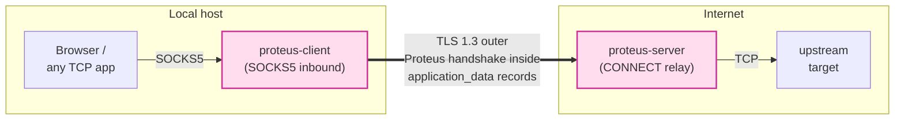

# Proteus

A research-grade anti-censorship transport protocol in active
development. **Cryptographically stronger than VLESS+REALITY** (post-
quantum hybrid KEX + per-direction symmetric ratchet, neither of
which the others have). Throughput comparable to Hysteria2 / TUIC-v5
**under the regimes where each carrier is appropriate** — see the
honest carrier-comparison table further down.

**Status: M2.** α-profile (TCP+TLS 1.3) and β-profile (QUIC+BBR)
carriers both work end-to-end. Multipath QUIC, ECH binding,
`0xfe0d` ClientHello injection, MASQUE (γ-profile), and a
netem-based adversarial benchmark against Hy2/TUIC-v5 are M3+ work.
**Not yet production-ready for arbitrary-user deployment** — see
the gap analysis at the bottom of this README.


```mermaid
flowchart LR
    subgraph LocalHost["Local host"]
        App["Browser /<br/>any TCP app"]
        Client["proteus-client<br/>(SOCKS5 inbound)"]
    end
    subgraph Internet["Internet"]
        Server["proteus-server<br/>(CONNECT relay)"]
        Upstream["upstream<br/>target"]
    end
    App -- SOCKS5 --> Client
    Client == "TLS 1.3 outer<br/>Proteus handshake inside<br/>application_data records" ==> Server
    Server -- TCP --> Upstream
    classDef ours fill:#fde,stroke:#c39,stroke-width:2px
    class Client,Server ours
```

---

## Why Proteus

Proteus is the upgrade path for operators currently running
VLESS+REALITY who need:

- **Forward secrecy that actually rotates.** AEAD keys are ratcheted
  every 4 MiB / 16 384 records via `HKDF-Expand-Label`. REALITY uses
  one AEAD key for the entire session — a single key compromise leaks
  the whole conversation.
- **Post-quantum confidentiality.** The handshake hybridizes X25519
  with ML-KEM-768 (NIST PQC FIPS-203). REALITY ships classical X25519
  only; any session captured today is decryptable by a future CRQC.
- **Operator-tunable anti-DoS.** A SHA-256 proof-of-work gate sits in
  front of ML-KEM Decap (~50 µs/op). Bump `pow_difficulty` from `0` to
  `16` during a DoS alert and a single attacker IP can no longer
  saturate a core with garbage ClientHellos.
- **Memory DoS hard cap.** Each session's receive buffer is capped at
  16 MiB; a misbehaving peer cannot OOM the server.
- **Cover-server pass-through on auth failure.** Byte-verbatim splice
  to a real HTTPS endpoint (Cloudflare / Apple / etc.) — passive DPI
  sees nothing but a normal `Connection: close` on a generic HTTPS
  reverse proxy.
- **Real TLS 1.3 outer.** The Proteus handshake runs *inside* a
  standards-compliant TLS 1.3 `application_data` stream with ALPN
  `h2`/`http/1.1`. No private codepoints visible on the wire.

| | Proteus | VLESS + REALITY | Hysteria2 / TUIC-v5 |
|---|---|---|---|
| Forward secrecy with key rotation | ✅ 4 MiB symmetric ratchet | ❌ session-wide key | ❌ session-wide key |
| Post-compromise security (PCS heal) | ✅ DH ratchet at first 4 MiB | ❌ | ❌ |
| Post-quantum confidentiality | ✅ ML-KEM-768 hybrid | ❌ X25519 only | ❌ X25519 only |
| Per-session ephemeral server X25519 | ✅ | ❌ long-term server key | n/a |
| Rogue-cert MITM detection (RFC 5705) | ✅ α + β channel binding | ❌ | ❌ |
| Record-length traffic-analysis defense | ✅ cell-split shaping | ❌ exact lengths leak | ❌ exact lengths leak |
| Inter-record timing camouflage | ✅ cover-traffic heartbeats | ❌ | ❌ |
| `client_id` per-session unlinkability | ✅ per-session nonce + Poly1305 | n/a | n/a |
| O(1) Ed25519 verify (no timing/DoS) | ✅ AEAD-indexed allowlist | n/a | n/a |
| Anti-DoS proof-of-work | ✅ tunable | ❌ none | ❌ none |
| Memory exhaustion cap (handshake + post) | ✅ 64 KiB + 16 MiB | reliant on TCP | reliant on UDP |
| Real TLS 1.3 outer | ✅ rustls + ring | ✅ REALITY tunnel | ❌ QUIC |
| Cover-server splice on auth fail | ✅ | ✅ | ❌ |
| Mechanical mutual auth | ✅ Finished MAC chain | ⚠ short-id only | ⚠ trust on certificate |
| `cargo deny` / `cargo audit` clean | ✅ | n/a | n/a |
| Reproducible release build (Cargo.lock pinned) | ✅ | n/a | n/a |

**GFW 2026 QUIC SNI Inspector evasion** (USENIX Sec '25 paper "Exposing and Circumventing
SNI-based QUIC Censorship of the Great Firewall of China" — applied to β only;
α uses TLS 1.3 + REALITY-comparable cover):

| | Proteus β | VLESS + REALITY | Hysteria2 / TUIC-v5 |
|---|---|---|---|
| Source port ≤ destination port (#1) | ✅ bind walks `[dst-7 .. dst]` | n/a (TCP) | ❌ ephemeral src |
| Prefix-noise before QUIC Initial (#2) | ✅ 16 random bytes first-flight | n/a (TCP) | ❌ |
| Connection migration (#4 — 180 s 5-tuple drop escape) | ✅ `migrate()` + low source-port rebind | n/a (TCP) | ⚠ supported but no GFW-specific port pick |
| UDP datagram length uniformity | ✅ pad-to-MTU (operator opt-in) | n/a | ❌ |
| JA4 cipher_count toward Chrome | ⚠ 09 (Chrome 15) | ❌ rustls default | n/a (no TLS handshake on wire) |
| JA4 cipher wire-order Chrome-aligned | ✅ 0x1301 first | ❌ rustls default 0x1302 first | n/a |
| compress_certificate (ext 0x001b) | ✅ rustls `brotli` feature | ❌ | n/a |
| ML-KEM-768 hybrid handshake (PQ) | ✅ X25519 + ML-KEM-768 | ❌ X25519 only | ❌ X25519 only |
| QUIC CONNECTION_CLOSE indistinguishability (no wire-visible reject signal, RFC 9000 §19.19) | ✅ all closes are NO_ERROR+empty (3 wire tests + 1 static-source audit) | n/a (TCP) | ❌ distinct close codes leak policy |
| QUIC spin bit (RFC 9000 §17.4) — wire-visible passive RTT inference | ✅ `allow_spin_bit = false` default + random-fill compensation (wire-test pinned, 30-70% Bernoulli band) | n/a (TCP) | ❌ quinn upstream default = `true` |
| QUIC ACK frequency (RFC 9802) — bulk-flow ACK overhead | ⚠ knob exposed, **default disabled** — value `10` breaks BBR on sub-ms RTT (measured 107 → 0.5 MiB/s loopback collapse); operators opt in via `beta_ack_eliciting_threshold: 10` for measured long-fat-pipe paths only | n/a | ⚠ Hy2 tunes similarly, TUIC-v5 doesn't |
| QUIC MTU discovery upper bound | ✅ explicit `mtu_upper_bound = 1452` (pinned against quinn default drift; raise to 9000 for jumbo-frame paths) | n/a | ⚠ implicit reliance on quinn default |

---

## 2026 GFW threat intelligence — what we're tracking

Threat model updated 2026-05 to reflect the post-2025-09 commercial-DPI
era. Full analysis: [`qa/2026-05-17-gfw-2026-q1q2-threat-intel.md`](../../qa/2026-05-17-gfw-2026-q1q2-threat-intel.md).
Leak precis: [`notes/gfw/2025-09-11-geedge-mesa-leak.md`](../../notes/gfw/2025-09-11-geedge-mesa-leak.md).

**Seven active attack lines (2025 Q3 → 2026 Q2)**:

| # | Attack line | Status | Proteus coverage |
|---|---|---|---|
| 1 | Geedge / Tiangou commercial DPI (cross-deployment shared IP blocklist; 9 commercial VPNs flagged "resolved" in leak) | active, iterating | ✅ `proteus-server preflight check-ip-reputation` offline classifier (special-use detection + commercial-cloud table + operator watchlist); ❌ uTLS bit-perfect ClientHello still gap |
| 2 | 2026-04 mass commercial-node death (IDC physical disconnection, ISP cooperation; SS / V2Ray / Trojan / VMess wiped) | active, ongoing | ✅ direct-dial architecture immune by design; ✅ `deploy/README.md` "Deployment topology" section + security-checklist topology items; ✅ **multi-VPS HA client** (2026-05-18 — EndpointPool + EndpointHealth + YAML `server_endpoints:` with auto failover); ✅ **TLS cert-expiry + reload observability** (2026-05-18 — `proteus_tls_cert_not_after_unix_seconds` gauge + `_reload_attempts/_succeeded_total` counters + `admin status` "TLS cert" block with RENEW NOW / EXPIRED warnings; closes the silent-certbot-failure case that has killed multiple production Hy2/TUIC nodes) |
| 3 | QUIC SNI inspection (USENIX Sec '25 #1/#2/#4) | nationally deployed | ✅ all three evasions wired; ❌ ECH (P0 upgrade — only ECH actually *hides* SNI) |
| 4 | Application-layer active probing + timing analysis on cover URLs | escalating | ✅ cover-server splice + NO_ERROR closes; ✅ **cover-endpoint pool with per-src-IP /24 affinity** (no rotation signal); ✅ **probe-anomaly detector wired across both α and β** (sliding-window per-/24 counter + Prometheus alert); ✅ **detector recent-fires ring exposed via `/metrics` + admin CLI** (operator sees WHICH /24 fired in PromQL/Grafana AND in-terminal); ✅ **operator-opt-in auto-deny loop** (TTL-bounded in-binary deny list; entries auto-expire so false positives heal); ✅ **β pre-QUIC-handshake auto-deny short-circuit** (denied /24s get `Incoming::ignore()` BEFORE quinn pays the TLS+QUIC handshake cost; prober's wire view = server unreachable, no response packet at all); ✅ **auto-deny *current-state* surface** (2026-05-18 — Prometheus `proteus_auto_deny_active_prefixes`/`inserted_total`/`refused_inserts_total` + per-entry `proteus_auto_deny_remaining_secs{prefix=…}` labelled gauge AND `admin status` text/JSON block showing who is blocked right now + TTL countdown; closes the gap where long-TTL entries persisted past the recent-fires ring) |
| 5 | UDP / QUIC throttling (Hy2 / TUIC visibly degrades 2026 Q1+) | nationally deployed | ✅ α survives; ✅ **`CarrierHealth` automatic α↔β fallback** (2026-05-18, streak-based β suppression with capped exponential back-off + periodic recovery probe — single auto-clear on next β success); ❌ γ profile (MASQUE) still M3+ |
| 6 | DoH / DoT identification (bootstrap-layer attack on the client itself) | rolling out 2026 Q2 | ✅ `bootstrap_dns: { direct_ip: <ip> }` config + IP-literal endpoint passthrough + `proteus-client validate` WARN on unpinned hostnames |
| 7 | Fully-encrypted-traffic heuristics (USENIX Sec '23, 5 rules — still active) | stable | ✅ α satisfies rule 2 naturally; ⚠ β prefix-noise needs printable-byte tweak to satisfy rule 1 |

**Roadmap priorities driven by this threat intel**:

- **P0** (must precede any "production-ready" claim): ECH integration, ~~IP reputation preflight tool~~ ✅ **done 2026-05-17**, ~~`bootstrap_dns: direct_ip`~~ ✅ **done 2026-05-17**, ~~β prefix-noise printable-byte tweak~~ ✅ **done 2026-05-17**, ~~`deploy/README.md` anti-relay topology warning~~ ✅ **done 2026-05-18**. **4 of 5 P0 done**; only ECH (multi-week, rustls-fork) remains.
- **P1** (M3): uTLS bit-perfect ClientHello, ~~cover-endpoint pool~~ ✅ done 2026-05-18, ~~carrier auto-switch~~ ✅ done 2026-05-18 (`CarrierHealth`), ~~**multi-VPS HA client**~~ ✅ done 2026-05-18 (`EndpointPool` + `EndpointHealth` + YAML `server_endpoints:` + validate guidance + dispatch wired through SOCKS path + 18 tests including 2 real-server fall-to-backup e2e).
- **P2** (M3+): γ profile (MASQUE), β cover-forward, multipath QUIC.

The single most important update is conceptual: the adversary is no longer
a static research target. Geedge sells GFW as a product with paying
Belt-and-Road customers, which drives iteration faster than the public-research
community can keep up. Designs that beat "GFW as documented in USENIX
23–25" are necessary but not sufficient — we must beat "GFW as it will
be in 2027 after Geedge ships its next 4 customer-requested classifier
updates." This is why the protocol layer (already strictly stronger
than Reality + Hy2/TUIC5) is no longer the binding gap; **engineering
+ deployment posture** is.

---

## Quick start (Linux VPS)

```bash
# 1. Get binaries
git clone https://github.com/Icarus603/network-from-scratch
cd network-from-scratch/projects/proteus
cargo build --release --bin proteus-server --bin proteus-client
sudo install -m 0755 target/release/proteus-server /usr/local/bin/
sudo install -m 0755 target/release/proteus-client /usr/local/bin/

# 2. System user + dirs
sudo useradd --system --shell /usr/sbin/nologin proteus
sudo mkdir -p /etc/proteus/keys/tls /etc/proteus/keys/clients /var/log/proteus
sudo chown -R proteus:proteus /etc/proteus /var/log/proteus

# 3. Long-term keys (mode 0600)
sudo -u proteus proteus-server keygen --out /etc/proteus/keys

# 4. TLS cert. Production: use Let's Encrypt:
sudo certbot certonly --standalone -d vps.example.com
sudo cp /etc/letsencrypt/live/vps.example.com/fullchain.pem /etc/proteus/keys/tls/
sudo cp /etc/letsencrypt/live/vps.example.com/privkey.pem   /etc/proteus/keys/tls/
sudo chown proteus:proteus /etc/proteus/keys/tls/*
sudo chmod 0600 /etc/proteus/keys/tls/privkey.pem
# Testing: proteus-server gencert --dns-name vps.example.com --out /etc/proteus/keys/tls

# 5. Add each client's public key to the allowlist
sudo install -m 0644 alice.ed25519.pk /etc/proteus/keys/clients/

# 6. Config (see deploy/server.example.yaml)
sudo install -m 0644 deploy/server.example.yaml /etc/proteus/server.yaml
sudoedit /etc/proteus/server.yaml

# 7. Preflight: run EVERY offline check in one shot — IP reputation
#    classification (2026 GFW threat-intel main lines 1+4: catches
#    special-use binds + commercial-cloud over-collected ranges),
#    host posture (key file modes, ulimits, sysctls governing β QUIC
#    throughput, /dev/urandom, NTP, disk free), AND TLS ClientHello
#    JA4 fingerprint capture vs. locked baseline. Single command,
#    one exit code, one unified report.
proteus-server preflight all \
    --config /etc/proteus/server.yaml \
    --public-ip "$(curl -s https://api.ipify.org)"
# Exit 0 on PASS+WARN-only across all sections, 1 on any FAIL.
# Watchlist: --watchlist /etc/proteus/burned-ips.txt
# JSON for scripted deploy gates: --format json (one-line summary).
# Sub-checks individually: `preflight check-ip-reputation`,
# `preflight check-host`, `fingerprint` (still standalone, identical
# semantics, useful when you want a single section in isolation).

# 8. systemd unit
sudo install -m 0644 deploy/systemd/proteus-server.service /etc/systemd/system/
sudo systemctl daemon-reload
sudo systemctl enable --now proteus-server
sudo journalctl -u proteus-server -f
```

Client side:

```bash
proteus-client keygen --out ./keys/client
# Send keys/client/client.ed25519.pk to your server admin.
cp deploy/client.example.yaml ~/.proteus.yaml
$EDITOR ~/.proteus.yaml

# Host-posture preflight before launch: mirrors `proteus-server
# preflight check-host`. Audits client-side footguns the binary
# wouldn't catch at load: client_ed25519_sk mode (long-term identity
# SK exposure on shared/multi-user hosts), server endpoint DNS
# resolvability (typo'd hostname surfaces here, not as opaque
# CONNECT failures), bootstrap_dns consistency (DoH-leak surface
# per 2026 GFW threat-intel main line 6), trusted_ca PEM
# readability (silent rustls fallback to webpki-roots), and the
# basic urandom + clock-sync checks (broken NTP = server rejects
# every handshake as 'replay'). Read-only — only network access
# is a DNS lookup, gated by --skip-dns-resolution for air-gapped CI.
proteus-client check-host --config ~/.proteus.yaml
# Exit 0 on PASS+WARN-only, 1 on any FAIL. --format json for
# scripted deploy gates (Ansible/Terraform). Symmetric exit-code
# semantics with the server side's `preflight all`.

proteus-client run --config ~/.proteus.yaml
curl --socks5 127.0.0.1:1080 https://www.example.com/
```

### Client observability (`proteus-client status`)

Set `admin_listen: "127.0.0.1:9091"` in `client.yaml` to enable an
opt-in loopback HTTP surface mirroring what `proteus-server admin
status` provides for the server side:

```bash
# In a running terminal (with admin_listen set):
proteus-client status              # human-readable text
proteus-client status --format json # parseable JSON

# Or curl directly:
curl -s http://127.0.0.1:9091/status
curl -s http://127.0.0.1:9091/status.json | jq .
curl -s http://127.0.0.1:9091/healthz   # 200 alive / 503 starting

# Prometheus scrape — symmetric with the server-side /metrics
# endpoint. All series use the `proteus_client_*` prefix so a single
# Prometheus instance can scrape both ends without label collisions.
curl -s http://127.0.0.1:9091/metrics
```

Prometheus series exposed:

- Global: `proteus_client_up`, `proteus_client_dials_{attempted,succeeded,failed}_total`
- Concurrency: `proteus_client_{in_flight,max_inflight}_sessions` (when cap configured)
- Carrier (β): `proteus_client_carrier_{suppressed,failure_streak,suppression_secs_remaining}`
- Per-endpoint (labelled with `addr="host:port"`):
  `proteus_client_endpoint_{attempts,successes,failures}_total`,
  `proteus_client_endpoint_{suppressed,failure_streak,suppression_secs_remaining}`

PromQL example — alert when any endpoint's 5-minute success rate
drops below 80 %:

```promql
sum by (addr) (rate(proteus_client_endpoint_successes_total[5m]))
/ sum by (addr) (rate(proteus_client_endpoint_attempts_total[5m]))
  < 0.8
```

PromQL example — alert when **any** CONNECT silently went through
the OS resolver (= 2026 GFW DoH-identification attack vector silently
bypassing the operator's `bootstrap_dns: direct_ip` policy):

```promql
rate(proteus_client_bootstrap_via_system_resolver_total[5m]) > 0
```

PromQL example — alert when **any** server-side SIGHUP reload
silently failed (firewall edit ignored due to parse error, or a
rate-limit section in YAML but no limiter installed at startup):

```promql
(proteus_firewall_reload_attempts_total
   - proteus_firewall_reload_succeeded_total) > 0
or
(proteus_rate_limit_reload_attempts_total
   - proteus_rate_limit_reload_succeeded_total) > 0
or
(proteus_user_rate_limit_reload_attempts_total
   - proteus_user_rate_limit_reload_succeeded_total) > 0
or
(proteus_handshake_budget_reload_attempts_total
   - proteus_handshake_budget_reload_succeeded_total) > 0
```

Each pair has the same shape + semantics as `proteus_tls_reload_*`
— operators get consistent alerting across all 5 hot-reload paths.

PromQL example — alert when the deployed config shape DRIFTS from
the operator's intent (e.g. firewall block accidentally commented
out at process restart):

```promql
# Expected: tls + firewall + probe_anomaly all present.
proteus_config_section_active{section="tls"} != 1
or
proteus_config_section_active{section="firewall"} != 1
or
proteus_config_section_active{section="probe_anomaly"} != 1
```

The per-section gauges are set-at-startup (SIGHUP can mutate the
section's content but cannot toggle its presence — adding a brand-
new section requires a restart) so the alert fires only when the
process restarts with a different config shape than intended.

PromQL example — alert when fleet hasn't picked up the new binary
version, or when a process restarted unexpectedly recently:

```promql
# Stragglers from a 0.2.0 rollout.
proteus_build_info{version!="0.2.0"} == 1

# Recently-restarted processes (likely OOM kill or crash).
(time() - proteus_process_start_unix_seconds) < 300
```

The build-info gauge is the Prometheus-canonical "always 1" gauge
with metadata in labels — same shape as `go_info` etc. `version`,
`rustc`, and `target` are exposed; absent fields render as `""`
without breaking parsers.

On Linux deployments, `/metrics` also exposes per-process resource
gauges captured live per scrape — `proteus_process_open_fds` (count
of `/proc/self/fd/` entries) and `proteus_process_resident_memory_bytes`
(parsed from `VmRSS:` in `/proc/self/status`). PromQL for FD-leak
detection in production:

```promql
# FD count growing by >10/hour with no corresponding session growth.
deriv(proteus_process_open_fds[1h]) > 10
  unless on (instance) deriv(proteus_in_flight_sessions[1h]) > 0

# RSS growing by >10 MiB/hour during steady-state traffic.
deriv(proteus_process_resident_memory_bytes[1h]) > 10 * 1024 * 1024
```

Both gauges are Linux-only by design (production deploys are
Linux; macOS / Windows dev rigs see absent series, which PromQL's
`absent()` correctly distinguishes from a zero value). Client
emits the same shape under the `proteus_client_*` prefix.

### Per-user bandwidth accounting (server)

Server `/metrics` exposes per-user bandwidth counters tagged by
the `user_id` matched at handshake — operators see who's using how
much in real time:

- `proteus_per_user_bytes_sent_total{user_id="alice001"}` (counter)
- `proteus_per_user_bytes_received_total{user_id="alice001"}` (counter)
- `proteus_per_user_bandwidth_tracked_users` (gauge — distinct
  user_ids; cap = 4096 by default; overflow accumulates into
  `user_id="__overflow__"`)

PromQL recipes:

```promql
# Top 5 bandwidth users right now.
topk(5, rate(proteus_per_user_bytes_sent_total[1m]))

# User pushing > 100 MB/s — likely abuse / stolen credential.
rate(proteus_per_user_bytes_sent_total[1m]) > 100 * 1024 * 1024

# Asymmetric exfil: rx >> tx for one user — credential being
# used to upload data, not browse.
  rate(proteus_per_user_bytes_received_total[5m])
/ rate(proteus_per_user_bytes_sent_total[5m]) > 10

# Track-cap overflow — operator should raise max_users.
proteus_per_user_bandwidth_tracked_users >= 4096
```

User-id rendering: ASCII-printable user_ids (e.g. `alice001`)
render verbatim; non-printable or quote-containing ids fall back
to `hex:<16hexchars>` for safety. The cap is a hard memory bound;
beyond it, additional user_ids accumulate into `__overflow__` so
bandwidth accounting stays complete even when individual
attribution is lost.

### Per-user **sustained-bandwidth** abuse detector (server)

`/metrics` PromQL alerts work for ops teams running Prometheus +
Alertmanager. The canonical Proteus operator — personal-VPN-for-
friends on one VPS, `journalctl` + maybe a Telegram bot tailing
logs — has no alerting infrastructure. The server ships an
**in-process** sustained-bandwidth detector that fires structured
WARN logs + bumps a counter the moment a user crosses the
threshold:

```yaml
# server.yaml
per_user_bandwidth_rate:
  window_secs: 30                 # rolling-window length
  threshold_mb_per_sec: 100       # 100 MB/s sustained = abuse
  max_users: 4096                 # match per-user accumulator cap
  exit_factor: 0.5                # hysteresis: re-arm at 50 MB/s
```

Wire-up: the detector hooks into the per-user bandwidth accumulator
(`PerUserBandwidth::set_rate_detector`) so every session-completion
runs the rate check inside `InFlightGuard::drop`. On `Fired`, the
server emits:

```text
WARN abuse: per-user sustained bandwidth above threshold —
     possible stolen credential or exfiltration tool.
     Fire-once-per-burst; resets after rate drops to half threshold.
     user_id="alice001" bytes_per_sec=125829120
```

and bumps `proteus_abuse_alerts_per_user_bandwidth_total` (counter,
always emitted at 0 from t=0 so operators script `increase(... [5m])
> 0` even before the first fire).

**Why hysteresis matters**: without it, a user oscillating at the
threshold boundary (~99-101 MB/s) generates an alert every burst.
The `exit_factor` (default 0.5) requires the rate to drop to half
threshold before re-arming, so the same user gets ONE alert per
sustained burst.

**Threshold = 0 = "wired but silent"**: leaves the slot installed
(so a SIGHUP-driven config swap can flip the threshold to non-zero
later without a restart) but every record returns Quiet. Gauges
still emit so operators can confirm via
`proteus_per_user_bandwidth_rate_threshold_bytes_per_sec` that the
slot is alive.

### Per-user **concurrent session cap** (server)

The bandwidth-rate detector above catches *sustained throughput*
abuse. A smart attacker with a stolen credential side-steps it by
opening many short parallel sessions — each one stays under any
single-session threshold, but the aggregate FD / RAM / upstream-
bandwidth footprint is enormous. Real-world reference: NordVPN
caps 6 simultaneous devices per account, ExpressVPN 8, Mullvad 5;
VLESS / Hy2 / TUIC5 have **nothing** at the protocol layer.

Proteus closes that gap:

```yaml
# server.yaml
per_user_conn_limit:
  max_per_user: 6    # commercial-VPN-grade per-account device cap
```

Wire-up: every session-handler closure (β-QUIC / α-TCP / α-TLS)
calls `try_acquire(user_id)` AFTER handshake (so the user_id is
authenticated) but BEFORE the relay opens upstream. On reject the
session is torn down immediately — *not* routed to `cover_endpoint`,
because the user authenticated successfully and a cover-redirect
would mis-leadingly imply "wrong credential". The RAII guard
decrements the count on drop, including panic unwind.

`/metrics` series (always emitted, even at zero):
- `proteus_per_user_conn_limit_max_per_user` — gauge of the cap
- `proteus_per_user_conn_limit_active_users` — distinct user_ids
  currently holding ≥1 slot
- `proteus_per_user_conn_limit_rejected_total` — counter, alert on
  `rate(...) > 0` (credential abuse OR under-provisioned cap)

**max_per_user = 0 = "wired but disabled"**: same SIGHUP-swap slot
pattern as the bandwidth-rate detector. Recommended defaults: 4-6
for personal-VPN-for-friends; 6-10 for small workgroups.

The cap is per-user *across* the three carriers (β-QUIC, α-TCP,
α-TLS) — all of them share the same limiter instance, so a user
opening 3 QUIC sessions + 3 TCP sessions hits the cap of 6 across
the union.

### Recent abuse fires — answering "WHICH user_id?" without journald

Aggregate abuse counters (`proteus_abuse_alerts_*_total`) tell
operators THAT abuse happened; the actionable question is WHICH
`user_id` to rotate the credential for. Grepping `journalctl -u
proteus-server | grep abuse` works but is slow, requires journald
access, and is hard to script.

Proteus ships a bounded **ring buffer of the last N abuse fires**
(default capacity 64 — covers "last hour" for any sane deployment,
~1.5KB memory). All three detectors push into it:

| Detector | `kind` label | `context_value` |
|---|---|---|
| `abuse_detector.byte_budget` | `byte_budget` | `0` |
| `abuse_detector.rate_limit` | `rate_limit` | `0` |
| `per_user_bandwidth_rate_detector` | `per_user_bandwidth_rate` | computed rate (bytes/sec) |

Operator surfaces:

- **`/metrics`** — two gauges, always emitted:
  `proteus_abuse_recent_fires_capacity` and
  `proteus_abuse_recent_fires_count`. Alert on
  `count == capacity` (buffer rotating ⇒ abuse so frequent
  operators must investigate immediately). The buffer's CONTENTS
  are NOT exposed on `/metrics` to avoid label-cardinality
  explosion across user_id × kind × scrape.
- **`/diagnose`** — human-readable table prepended to the existing
  diagnose body. Columns: `secs_ago`, `kind`, `user_id`,
  `context_value`. Sorted oldest-first to match WARN log
  chronology. Operators run:
  ```bash
  curl -s -H "Authorization: Bearer $METRICS_TOKEN" \
       http://127.0.0.1:9090/diagnose
  ```
  and see exactly which user_ids fired what.
- **JSON Lines** rendering also available on the buffer for
  scripted consumers (Telegram bots, oncall pagers); schema is
  append-only.

The buffer is wired **automatically** in the binary — no YAML opt-
in. The memory footprint is fixed and the operational value is
high enough that every deployment gets it.

### Auto-quarantine — detection → enforcement, without humans in the loop

The abuse-fires ring buffer surfaces WHO fired, but operators still
need to MANUALLY rotate the credential or restart the server.
While they sleep, the attacker keeps exfiltrating. The IP-based
[`auto_deny`](#) closes the same loop for source-IP /24 prefixes
flagged by the probe-anomaly detector; this is the per-credential
sibling.

```yaml
user_quarantine:
  ttl_secs: 600                    # 10-minute ban; refreshes on each fire
  max_entries: 4096                # memory bound; matches other per-user caps
  on_kinds:
    - per_user_bandwidth_rate      # strongest signal — always opt in
    - rate_limit                   # optional — fires on repeated rate hits
    # byte_budget                  # noisiest; opt in only if you trust it
```

Wire-up: when an opted-in abuse-fire kind fires (anywhere among
the three detectors), the offending user_id is inserted into a
TTL-bounded HashMap. The `user_admission_ok` post-handshake gate
checks this map BEFORE the per-user rate limiter, so subsequent
handshakes from the banned user_id are torn down cleanly.

Operator surfaces:

- **`/metrics`** — six gauges + counters:
  `proteus_user_quarantine_{ttl_seconds,max_entries,active_entries,inserted_total,refused_inserts_total,hits_total}`,
  plus the always-emitted server-level
  `proteus_user_quarantine_rejected_total` (handshakes blocked at
  the admission gate). Operators alert on
  `rate(proteus_user_quarantine_hits_total[5m]) > 0` — the "did
  the quarantine actually save us?" PromQL.
- **`/diagnose`** — USER QUARANTINE table prepended right after
  the RECENT ABUSE FIRES table, so operators read the narrative
  top-down: "abuse fired → user_id auto-banned → ban expires in
  Ns".

**`ttl_secs=0`** = wired but disabled (SIGHUP-swap slot). Entries
auto-expire so transient false positives self-heal without
operator intervention; refreshes on repeat fires extend the ban
clock from "now" (so a user that keeps tripping detectors stays
banned).

**Why per-user-id, not per-IP**: a stolen credential used across
a botnet of residential IPs defeats per-IP enforcement. Per-
credential enforcement attacks what's actually leaked.

**Mid-burst tear-down**: when an abuse fire quarantines a user_id,
ALL in-flight sessions for that user_id are torn down immediately
(via `tokio::sync::Notify` woken by `notify_waiters()`). Without
this, the attacker mid-burst would get to finish their current
upload before the quarantine took effect (the per-session pumps
were parked on reads inside the relay's `tokio::select!`, blocked
on `recv_record()` until idle timeout, byte budget, or peer
close). The relay's `select!` now has a third branch listening
on a per-session `Arc<Notify>` registered at session start; the
quarantine list holds a `Vec<Weak<Notify>>` per user_id so a
single insert wakes every active session for that user at once.
`proteus_user_quarantine_sessions_torn_down_total` is the
operator-facing counter for this — alert on it to catch every
mid-burst exfil that was interrupted, not just every new
handshake that was blocked.

**Persistence across restarts**: a stolen credential that gets
banned for 10 minutes, then the process OOMs / systemd restarts /
operator deploys a new binary, gets a FRESH attack window of TTL
minutes until the next abuse fire re-detects them. To close this
gap, the quarantine list supports JSON Lines persistence:

```yaml
user_quarantine:
  ttl_secs: 600
  max_entries: 4096
  on_kinds: [per_user_bandwidth_rate, rate_limit]
  persistence_path: /var/lib/proteus/user_quarantine.jsonl
```

Every insert (fresh or refresh) writes the current map to disk
atomically (temp file + rename — never partially-written on
crash). On startup, the binary loads the file, filters
already-expired entries, and seeds the in-memory map. The format
is operator-readable + hand-editable for emergency unbans —
delete a line, restart.

Persistence counters (`proteus_user_quarantine_persist_attempts_total`,
`_failed_total`, `_loaded_from_disk`) make silent-write-failure
visible: a non-zero `failed_total` means bans will NOT survive a
restart, alert on it. Mirrors the SIGHUP-reload counter pattern.

**Live operator override via SIGHUP**: when a false positive bans
a user that operators need to unblock RIGHT NOW (or operators
spot abuse via dashboards and want to ban a user BEFORE the
detectors fire), the persistence file becomes the source of
truth for live reconciliation:

```bash
# Lift alice's false-positive ban:
sudo vim /var/lib/proteus/user_quarantine.jsonl  # delete alice's line
sudo systemctl kill --signal=HUP proteus-server

# Manually ban a known-abusive user immediately:
sudo bash -c 'cat >> /var/lib/proteus/user_quarantine.jsonl' <<EOF
{"user_id":"bob00002","expires_unix_seconds":$(($(date +%s)+3600)),"triggered_by":"manual"}
EOF
sudo systemctl kill --signal=HUP proteus-server
```

The SIGHUP handler calls `reload_from_disk()` which reconciles
in-memory state against the file:

- File entries not in memory → INSERT + tear down in-flight
  sessions for those user_ids (mirrors the auto-ban path).
- Memory entries not in file → REMOVE (operator unban; no
  session tear-down).
- Entries in both → UPDATE in place. Sessions torn down only
  when the expiry moves FORWARD (extending a ban re-arms
  enforcement; shortening one doesn't punish further).
- Missing file → clear every in-memory entry (operator deleted
  the file to lift all bans).

Plus three operator-visible counters surface live ops:
- `proteus_user_quarantine_manual_unquarantines_total` — calls
  to the programmatic `unquarantine()` API.
- `proteus_user_quarantine_reload_attempts_total` /
  `_failed_total` — SIGHUP-driven reload cycles; alert on
  `failed > 0` to spot operator hand-edits that produced an
  unreadable file.

### Per-user **period-based data quotas**

Every defense above caps a **rate** or a **single session**. None
caps **cumulative bytes over time**. A patient attacker with a
stolen credential who stays under per-session caps AND under
sustained-rate thresholds can quietly drain TBs over weeks —
1 MB/s every second for 30 days = 2.6 TB, and no alarm fires.

Every commercial VPN has period-based quotas (Mullvad free tier
5 GB total; Cloudflare WARP 1 GB/month; enterprise admins set
per-user monthly caps). Proteus matches that shape:

```yaml
user_quotas:
  period_secs: 2592000                  # 30 days
  default_period_bytes: 107374182400    # 100 GB monthly default
  max_entries: 4096
  persistence_path: /var/lib/proteus/user_quotas.jsonl
  overrides:
    - user_id: alice001
      period_bytes: 53687091200         # 50 GB for alice
    - user_id: vip00001
      period_bytes: 0                   # unlimited (VIP override)
```

How it works:
- `PerUserBandwidth::record_with_rate_check` (called from
  `InFlightGuard::drop`) charges `(tx + rx)` against the user's
  quota bucket alongside the rate-detector check.
- `user_admission_ok` (post-handshake admission gate) rejects
  any user_id with `is_over_quota(uid) == true`, BEFORE the
  rate limiter sees it. Counter:
  `proteus_user_quota_admission_rejected_total`.
- Period rolls over automatically: at `period_started_at +
  period_secs`, the bucket resets to 0 and the start advances.
- Disk persistence (atomic write, JSONL, same shape as
  `user_quarantine`) so quotas survive process restarts —
  otherwise an attacker could bypass by bouncing the binary.
- SIGHUP reconciles in-memory state against the file. Operators
  hand-edit to grant a user a fresh allotment (lower
  `used_bytes`) or change a `cap_override` without a restart.
- Programmatic `reset_user(uid)` API + `set_user_cap(uid, bytes)`
  for operator override paths.

Operator-visible Prometheus series (11 list-emitted +
`proteus_user_quota_admission_rejected_total` always-emitted):

```
proteus_user_quota_period_seconds                  # gauge — configured period
proteus_user_quota_default_cap_bytes               # gauge — default cap
proteus_user_quota_tracked_users                   # gauge — distinct users
proteus_user_quota_over_quota_transitions_total    # counter — under→over events
proteus_user_quota_admission_blocks_total          # counter — admission rejects
proteus_user_quota_period_rollovers_total          # counter — period resets
proteus_user_quota_persist_attempts_total          # counter — disk writes
proteus_user_quota_persist_failed_total            # counter — write failures
proteus_user_quota_loaded_from_disk                # gauge — startup restores
proteus_user_quota_reload_attempts_total           # counter — SIGHUP reloads
proteus_user_quota_reload_failed_total             # counter — SIGHUP reload errors
proteus_user_quota_admission_rejected_total        # counter — admission gate hits
```

`/diagnose` adds a USER QUOTA table sorted heaviest-first so
operators see who's about to hit their cap at the top.

### Startup self-test — catch broken crypto BEFORE the listener binds

Every defense above assumes the binary's crypto stack actually
works. But a typo in `mlkem_sk` path, a YAML edit that swapped
just one of the X25519/ML-KEM keys, a `cargo update` that broke
`ring`/`chacha20poly1305`/`ml-kem` — any of these silently fails
at production time. Operators only learn about it when real
users start failing handshakes (= fresh outage during every
restart).

Proteus runs a **full loopback handshake against the operator's
real keys BEFORE binding the public listener**. The flow:

1. Bind `127.0.0.1:0` (in-process).
2. Spawn a one-shot server using the real `ServerKeys`.
3. Mint an ephemeral client identity + run the production
   `client::handshake_over_tcp`.
4. Roundtrip a probe record; verify the AEAD path in both
   directions.
5. Report per-phase timings (handshake ms, roundtrip ms, total).

```yaml
# server.yaml
startup_self_test_timeout_secs: 10   # default; 0 = disable (NOT for production)
```

Failure aborts the binary with `exit code != 0` — systemd sees
the failure, the operator's deploy gate (Ansible / Terraform /
CI) catches it. Healthy binary logs:

```text
INFO startup self-test PASSED — crypto stack is healthy, proceeding to bind listener
  total_ms=1 handshake_ms=1 roundtrip_ms=0
```

Operator-visible Prometheus surface:

- `proteus_startup_self_test_passed` (gauge, always emitted —
  `0` until startup completes, `1` once the self-test passed).
  Alert on `== 0` to spot deploys where the binary started
  without proving its crypto path works.

The self-test ALSO catches per-phase regressions: a `cargo
update` that makes ML-KEM keygen 10x slower is visible in the
startup log as a `handshake_ms` jump even when the handshake
still succeeds. Operators paying attention to startup timings
notice these BEFORE they impact real users.

### Periodic self-test — /healthz reflects LIVE crypto health

The startup self-test runs ONCE and never again. What about
regressions that develop AFTER the binary starts? Disk fills up
→ RNG entropy reads start failing intermittently. A long-running
process accumulates state that degrades. Operator's clock
drifts past the replay window. `/healthz` today returns 200
based on `alive` (set once at startup) — even if the binary is
deadlocked, OOM'd, or has a frozen accept loop, `/healthz`
still says 200, so load balancers keep routing real traffic to
a dying server.

```yaml
periodic_self_test_interval_secs: 60   # 0 = disabled (default)
```

A background tokio task runs the same loopback handshake every
N seconds against freshly-loaded keys. On failure:

1. `last_periodic_self_test_passed` gauge flips to 0.
2. `/healthz` immediately returns **503 `self_test_failed`** —
   load balancers route traffic away from this instance.
3. `proteus_periodic_self_test_failed_total` increments —
   alert on `rate(...) > 0`.

Plus a staleness rule: if the last successful test was more
than `3 × interval_secs` ago, `/healthz` returns
**503 `self_test_stale`**. This catches a hung self-test task
(tokio deadlock, GC pause, OOM-killed thread) where the gauge
is technically still `true` from the last success but the
binary has stopped running the cycle.

Re-loads keys from disk every cycle: cheap (file I/O,
microseconds) and ALSO catches a `chmod 000` on the key file
mid-run.

Operator-visible Prometheus surface:

```
proteus_last_periodic_self_test_passed              # gauge — most recent outcome
proteus_last_periodic_self_test_unix_seconds        # gauge — last success time
proteus_periodic_self_test_attempts_total           # counter — cycles run
proteus_periodic_self_test_failed_total             # counter — cycles that failed
```

Recommended production values:
- `periodic_self_test_interval_secs: 60` — 1-minute cadence.
  Operators get the LB stale-rule fire after 3 minutes
  (180s = 3 × 60s) — fast enough to limit user-visible damage,
  slow enough not to thrash on transient blips.
- For low-traffic personal VPNs, `300` (5 min) is fine; the
  staleness window then is 15 min.

### Handshake-latency histogram — catch p99 regressions before users complain

Aggregate counters tell operators *how many* handshakes happened
but not *how long they took*. A p99 creeping from 50ms to 500ms
is the leading indicator of nearly every production problem:
CPU contention from a noisy VPS neighbour, GC / RT pauses, ML-KEM
keygen regression after a `cargo update`, kernel scheduler issues
under concurrency, network jitter on the loopback. Without a
histogram, operators discover latency regressions only via
user complaints.

Proteus ships a Prometheus-compatible histogram on the
handshake-complete code path. Both carriers (α-TCP/TLS and
β-QUIC) measure wall-clock from `accept` to handshake
completion and feed it into `proteus_handshake_duration_seconds`.

The histogram uses the canonical Prometheus client default
bucket boundaries (seconds): `[0.005, 0.01, 0.025, 0.05, 0.1,
0.25, 0.5, 1.0, 2.5, 5.0, 10.0]`. Covers fast-loopback (sub-10ms)
through degraded-handshake (multi-second) — the operationally
relevant range.

```promql
# p99 over the last 5 minutes:
histogram_quantile(0.99,
  rate(proteus_handshake_duration_seconds_bucket[5m])
)

# Alert on p99 > 200ms (operationally degraded):
histogram_quantile(0.99,
  rate(proteus_handshake_duration_seconds_bucket[5m])
) > 0.2

# Average handshake time (sum / count is the canonical mean):
  rate(proteus_handshake_duration_seconds_sum[5m])
/ rate(proteus_handshake_duration_seconds_count[5m])
```

The histogram is hand-rolled (no `prometheus`-crate dep) to
keep the data-plane lock-free: per-bucket `AtomicU64` counters
+ an atomic microsecond sum. `observe()` is ~12 relaxed atomic
adds — well below contention thresholds for any production
handshake rate.

### TLS cert auto-reload for non-certbot deploys

The existing TLS reload path (SIGHUP-driven) works perfectly for
Let's-Encrypt + certbot's deploy-hook. For everyone else
(corporate CA, internal PKI, manual rotations, scripted
deploys), if the operator's deploy script forgets to SIGHUP,
the binary keeps serving the OLD cert until expiry — silently.
The `proteus_tls_reload_*` counters tell operators "no SIGHUP
fired since the renewal" but only AFTER the cert expired.

Proteus ships a file-mtime watcher that closes this gap:

```yaml
tls_cert_watcher_interval_secs: 60   # 0 = disabled (default)
```

How it works:

1. At startup, the watcher stamps the cert + key file mtimes.
2. Every N seconds, `stat()` both paths.
3. If either mtime advanced, fire `reload_with_expiry` through
   the same path SIGHUP uses. The acceptor swaps in the fresh
   chain; the `proteus_tls_cert_not_after_unix_seconds` gauge
   updates.

Counters:

```
proteus_tls_cert_watcher_mtime_changes_observed_total
proteus_tls_cert_watcher_auto_reload_attempts_total
proteus_tls_cert_watcher_auto_reload_succeeded_total
proteus_tls_cert_watcher_auto_reload_failed_total    # alert on rate > 0
```

A non-zero `auto_reload_failed_total` rate is the operator's
strongest signal that a deploy produced a malformed PEM (the
binary keeps serving the OLD cert; the counter surfaces what
would otherwise be silent failure).

**Why mtime not inotify/kqueue**: portability (Linux uses
inotify, macOS uses kqueue; the periodic `stat()` works on
both) + atomicity (most operator cert-deploy scripts already
do temp-file-then-rename, and `stat()` after the rename sees
the new mtime cleanly).

**Recommended for operators using non-certbot rotations**:
`tls_cert_watcher_interval_secs: 60`. Picks up a fresh cert
within a minute; `stat()` cost is microseconds. Combined with
the existing SIGHUP path, operators have both push (SIGHUP)
and pull (mtime) trip-wires for cert rotation.

### Client-side `/healthz` staleness rule

The client (SOCKS5 inbound proxy on the user's machine) exposes
`/healthz` for downstream apps (browser, IDE, mobile app) to
probe before sending traffic through. Today `/healthz` returns
200 the moment the SOCKS5 listener binds — and stays 200 even
if every upstream Proteus dial fails for the next 10 hours.
Downstream apps stall on a broken proxy because nothing tells
them to fall back.

```yaml
# client.yaml
healthz_staleness_secs: 120   # 0 = staleness rule disabled (default)
```

When set, `/healthz` consults a three-gate check:

1. SOCKS5 alive (top priority — strongest signal).
2. **Dial freshness**: if ≥1 dial attempted AND the last
   successful dial was more than N seconds ago, return
   **503 `dial_stale`**.
3. **Never succeeded**: if ≥1 dial attempted AND no success
   ever recorded, return **503 `dial_never_succeeded`**.

Downstream apps probing /healthz then fall back to direct
connection (or display a "proxy degraded" banner) instead of
hanging on broken dials.

Operator surface (always emitted on `/metrics`):

```
proteus_client_last_dial_success_unix_seconds   # gauge — 0 = never
proteus_client_healthz_staleness_secs           # gauge — operator threshold
```

PromQL recipe for an alert (independent of the client's own
`/healthz` flip — useful when the client's admin endpoint
isn't scraped but the gauges go to a separate Prometheus):

```promql
proteus_client_healthz_staleness_secs > 0
  AND time() - proteus_client_last_dial_success_unix_seconds
    > proteus_client_healthz_staleness_secs
```

Recommended for production: 120 seconds (2 min). Catches a
wedged upstream within ~2 min so downstream apps fall back
fast without thrashing on transient blips.

### Live TLS ClientHello JA4 fingerprint — operator-visible

The `proteus-fingerprint` crate ships a JA4 regression test
that LOCKS the exact JA4 string Proteus α emits today
(`t13d0911h2_f91f431d341e_165ef185bad8`). The test catches
fingerprint drift at CI time — but only if the operator's
release pipeline ran it.

For deployments built outside the canonical release flow
(operator built from main, custom fork, etc.), the live JA4
gauge surfaces the wire fingerprint in real time:

```
proteus_tls_clienthello_ja4{value="t13d0911h2_f91f431d341e_165ef185bad8"} 1
proteus_tls_clienthello_ja4_expected{value="t13d0911h2_f91f431d341e_165ef185bad8"} 1
proteus_tls_clienthello_ja4_baseline_match 1
```

Operators alert on `proteus_tls_clienthello_ja4_baseline_match
== 0` to spot any wire-fingerprint drift:

- Regression (rustls upgrade silently changed cipher order, GREASE injection, ext list) → investigate before deploying further.
- uTLS-replay milestone landed → expected, update `EXPECTED_BASELINE` in BOTH `tls_fingerprint_observer.rs` AND the `proteus-fingerprint` baseline test.

The observer runs ONCE at startup against a loopback TLS
handshake using the operator's actual server cert. Capture
cost is microseconds; happens before the public listener
binds.

A unit test in `tls_fingerprint_observer.rs` keeps the two
`EXPECTED_BASELINE` literals (server-side observer + fingerprint
crate's CI test) in sync — drift in one without the other
fails the build.

### `proteus-server fingerprint` — offline operator diff

The live observer surfaces drift at runtime, but operators
want to verify the wire fingerprint **BEFORE** binding the
public listener — at deploy time, in CI, while the binary is
being smoke-tested. The `fingerprint` subcommand does exactly
that with zero network access and zero running server:

```bash
$ proteus-server fingerprint
Proteus α — live TLS ClientHello JA4 fingerprint
=================================================
  Live JA4:  t13d0911h2_f91f431d341e_165ef185bad8
  Baseline:  t13d0911h2_f91f431d341e_165ef185bad8
  Match:     yes (locked baseline)

Closest browser in reference table:
  Browser:   Firefox 124
  Platform:  macOS / Windows / Linux desktop
  Their JA4: t13d1714h2_5b57614c22b0_3d5424432f57
  Identical: no — ext_count and/or hashes still differ
  Counts:    ours [cipher=9, ext=11] vs theirs [cipher=17, ext=14]

All reference browsers in table:
  Chrome   124    macOS / Windows / Linux desktop  t13d1517h2_8daaf6152771_b0da82dd1658
  Firefox  124    macOS / Windows / Linux desktop  t13d1714h2_5b57614c22b0_3d5424432f57
  Safari   17.4   macOS 14                         t13d1716h2_5b57614c22b0_3d5424432f57
  Edge     124    Windows 11                       t13d1517h2_8daaf6152771_b0da82dd1658
```

Mechanics: mints a throwaway self-signed leaf in-process, runs
one loopback TLS handshake, captures the ClientHello bytes
server-side, computes JA4 via the `proteus-fingerprint` crate,
and diffs against (a) the locked baseline (b) the curated
browser reference table.

**Exit codes** — wire into CI / deploy gates:

- `0` — live JA4 matches `EXPECTED_BASELINE` (safe to deploy)
- `1` — drift (rustls upgrade, dependency bump, intentional
  uTLS-replay milestone — operator decides)

**JSON Lines mode** for scripted alerting:

```bash
$ proteus-server fingerprint --format json
{"kind":"fingerprint","live_ja4":"t13d0911h2_...","expected_baseline":"...","matches_baseline":true,"closest_browser":"Firefox","closest_version":"124","closest_platform":"macOS / Windows / Linux desktop","closest_ja4":"t13d1714h2_...","closest_exact":false}
```

Schema is append-only — new fields land but `live_ja4`,
`matches_baseline`, `closest_exact` stay stable so existing
jq pipelines don't break.

**Closeness metric** (used to pick `closest_browser`):

1. ALPN tag match (`h2` vs `h1`) → +10
2. JA4 cipher_hash exact match → +100
3. JA4 ext_hash exact match → +100
4. Penalty `-|cipher_count_delta|` and `-|ext_count_delta|`

`closest_exact == true` is the uTLS bit-perfect milestone — when
Proteus's wire shape matches a real browser byte-for-byte. As
of α it's `false` for every entry (Proteus emits rustls's
shape, not Chrome's); the gap will close when uTLS-replay
lands.

### `GET /diagnose` — one-shot self-check

Operators debugging a production issue (or filing a bug) hit
this single endpoint to get the curl-paste-share report:

```bash
curl -s -H "Authorization: Bearer $METRICS_TOKEN" \
     http://127.0.0.1:9090/diagnose
```

The body has two sections:

1. **`FINDINGS`** — rule-based self-check with severity tags
   (`[INFO]` / `[WARN]` / `[CRIT]`). Rules currently shipped:
   - `process_alive` / `process_ready` — the basic liveness pair
   - `tls_cert_ttl` — CRIT if < 1 day, WARN if < 14 days
   - `tls_reload_silent_failure` — CRIT if SIGHUP attempts >
     succeeded on the cert path
   - `firewall_reload_silent_failure` / `rate_limit_*` /
     `user_rate_limit_*` / `handshake_budget_*` — WARN per
     section when reload attempts > succeeded
2. **`METRICS`** — the full `/metrics` body verbatim, so the
   recipient has everything without asking for a second command.

Auth is bearer-token enforced (same gate as `/metrics`) because
the body includes cert TTLs and operator-sensitive counter
state.

### Client-side `GET /diagnose` mirror

The client exposes a symmetric `/diagnose` endpoint at
`http://127.0.0.1:9091/diagnose` (when `admin_listen` is set in
`client.yaml`). Same FINDINGS + STATUS + METRICS body shape.
Client-side rules:

- `process_alive` — INFO / CRIT
- `bootstrap_doh_leak` — **CRIT** when any CONNECT silently
  transited the OS resolver (operator intended `bootstrap_dns:
  direct_ip` but a hostname endpoint hit DoH)
- `carrier_suppressed` — WARN when β is in back-off
- `pool_entry_suppressed` — WARN per pool entry currently in
  back-off (operator sees WHICH endpoint is demoted)
- `pool_reload_silent_failure` — CRIT when SIGHUP attempts >
  succeeded on the pool path
- `dial_success_rate_low` — WARN when lifetime success rate
  < 90 % AND ≥ 10 attempts (rule fires only after enough data)

CLI wrapper:

```bash
proteus-client diagnose                          # default URL
proteus-client diagnose --url http://127.0.0.1:9091
```

The client emits a symmetric `proteus_client_process_*` +
`proteus_client_build_info{…}` triple — same shape, same alert
queries:

```promql
# Client-side fleet straggler detection.
proteus_client_build_info{version!="0.2.0"} == 1

# Recently-restarted client (likely OOM or systemd flap).
(time() - proteus_client_process_start_unix_seconds) < 300
```

### SIGHUP-driven `server_endpoints` hot-reload

Edit `client.yaml`'s `server_endpoints:` list (add a backup VPS,
demote a burned one, reorder), then `killall -HUP proteus-client`:

- Every new CONNECT after the SIGHUP uses the new pool order.
- In-flight sessions complete on their already-chosen endpoint.
- Per-endpoint cumulative counters + suppression state are
  **carried over** for entries whose address string is unchanged
  (counters follow the addr, not the index — operator can reorder
  freely without losing history).
- Entries newly added start at zero counters; entries removed are
  dropped.
- Empty list reload transitions back to single-endpoint dispatch
  mode (using `server_endpoint`).

Verify reload landed: `curl -s :9091/status` shows a
`Pool reloads (SIGHUP): N (N ok)` line after the first reload,
and Prometheus exposes `proteus_client_pool_reload_{attempts,succeeded}_total`
counters symmetric to the server's TLS-reload counters.

Surfaces:

- **CarrierHealth (β)**: configured? healthy / SUPPRESSED?
  seconds remaining in the back-off window? current failure streak?
- **EndpointPool (multi-VPS)**: per-entry health — addr, suppressed?,
  failure streak, **plus cumulative per-entry counters** (attempts,
  successes, failures). Operator demotes chronic-flaky entries based
  on the per-VPS success-rate, not just the global aggregate.
- **Concurrency**: `in_flight / max_inflight` — how saturated is the
  session-slot semaphore right now?
- **Dials**: cumulative `attempted` / `succeeded` / `failed`
  counters — script saturation alerts against the failure ratio,
  same shape as the server-side reload-success counters.

No authentication on this endpoint — bind loopback only.
`proteus-client validate` emits a WARN when `admin_listen` is bound
to a non-loopback interface.

---

## Layout

```
projects/proteus/
├── Cargo.toml              workspace manifest (rust-toolchain 1.85+)
├── Cargo.lock              PINNED for reproducible release builds
├── CHANGELOG.md            versioned release notes
├── deny.toml               cargo-deny policy: licenses + bans + advisories
├── deploy/
│   ├── server.example.yaml configuration template
│   ├── client.example.yaml
│   ├── systemd/proteus-server.service  hardened unit
│   ├── Dockerfile          multi-stage, non-root 911:911
│   ├── docker-compose.yml
│   └── README.md           full operator runbook (Let's Encrypt, scrape, RUST_LOG)
└── crates/
    ├── proteus-spec/                   constants (spec §4 / §6 / §26)
    ├── proteus-wire/                   byte-exact encoders/decoders + fuzz
    ├── proteus-crypto/                 hybrid KEX, ratchet, AEAD, KDF, sig, pow
    ├── proteus-shape/                  cell padding + shape-shift PRG
    ├── proteus-handshake/              state machine + replay window + auth_tag
    ├── proteus-transport-alpha/        TLS 1.3 outer + session + cover-forward + metrics
    ├── proteus-server/                 binary (run / keygen / gencert)
    └── proteus-client/                 binary (run / keygen) + SOCKS5 inbound
```

---

## CI gates (`.github/workflows/ci.yml`)

Every push and PR runs:

| Gate | Command | What it catches |
|---|---|---|
| `rustfmt` | `cargo fmt --all -- --check` | style drift |
| `clippy` | `cargo clippy --workspace --all-targets -- -D warnings` | correctness lints |
| `test` (Linux + macOS) | `cargo test --workspace --no-fail-fast` | 110 unit + integration + fuzz tests |
| `release build` | `cargo build --workspace --release --bins` + binary smoke (keygen / gencert / 0600-mode verify) | LTO / opt-level=3 / panic=abort divergence + CLI regression |
| `cargo audit` | `cargo install --locked cargo-audit && cargo audit --deny warnings` | RustSec advisories (1090 known) |
| `cargo deny` | `cargo install --locked cargo-deny && cargo deny check` | license / banned-crate / source / duplicate-version policy |

---

## Performance baseline

Measured on Apple Silicon M-series, release profile (criterion, n=30):

| Operation | Latency / Throughput |
|---|---|
| Handshake — client side (X25519 keygen + ML-KEM-768 Encaps) | **~40 µs** |
| Handshake — server side (X25519 DH + ML-KEM-768 Decaps) | **~43 µs** |
| AEAD seal — ChaCha20-Poly1305, 1 KiB record | **~595 MiB/s** |
| AEAD seal — ChaCha20-Poly1305, 4 KiB record | **~627 MiB/s** |
| AEAD seal — ChaCha20-Poly1305, 16 KiB record | **~645 MiB/s** |
| AEAD seal — ChaCha20-Poly1305, 64 KiB record | **~648 MiB/s** |
| AEAD open — ChaCha20-Poly1305, 1 KiB record | **~510 MiB/s** |
| **α end-to-end echo (TCP)  — 16 KiB records over loopback** | **~109 MiB/s (~0.87 Gbps)** |
| **α end-to-end echo (TCP)  — 64 KiB records over loopback** | **~120 MiB/s (~0.96 Gbps)** |
| **β end-to-end echo (QUIC) — 16 KiB records over loopback** | **~67 MiB/s (~0.54 Gbps)** |
| **β end-to-end echo (QUIC) — 64 KiB records over loopback** | **~57 MiB/s (~0.46 Gbps)** |

The end-to-end echo numbers above measure the **full round-trip
path**: client send → AEAD seal → BufWriter coalesce → carrier →
server AEAD open → server send back → client AEAD open. One-way goodput
in a real SOCKS5 relay scenario is roughly 2× this (echo doubles every
operation). Per-core single-stream ceiling is ~5 Gbps of bulk encrypt
throughput.

**Honest carrier comparison.** On loopback (zero loss, μs RTT) α
wins because QUIC pays TLS-record encrypt/decrypt + per-packet ACK
processing + extra syscalls (UDP recvmsg vs TCP read), and TCP gets
zero-cost reliability from the kernel. The β carrier exists for
the **opposite** regime: lossy long-fat pipes, where BBR vs CUBIC
flips the result. A netem-based head-to-head against Hy2/TUIC-v5 is
M3 work; **no "β beats Hy2" claim is honest without those numbers**.
The server-side handshake cost fits comfortably in the spec §17.2
80 µs budget. Hysteria2 and TUIC-v5 use the same ChaCha20-Poly1305 cipher
and hit the same cipher-bound ceiling; the per-handshake delta is
dominated by Proteus's ML-KEM-768 Decap (~30 µs) — the price of
post-quantum confidentiality (the others don't have).

To reproduce:
```bash
cargo bench -p proteus-crypto
```

### Runnable end-to-end bench (`proteus-bench`)

The criterion microbenches above measure individual primitives. The
**end-to-end** numbers come from a new `proteus-bench` binary (added
2026-05-18 — see [`crates/proteus-bench/`](./crates/proteus-bench/))
that exposes the in-tree `throughput_smoke` workload as a CLI. One
JSON line per run, stable schema, parameterized by `PerfProfile`
knobs — suitable for piping into `jq` and a netem-sweep CSV.

```bash
# Same-host β bench (mints fresh keys + cert, in-process):
cargo run --release -p proteus-bench -- beta --runs 5 --payload-mib 64

# Sweep PerfProfile padding to compare wire-uniformity cost:
cargo run --release -p proteus-bench -- beta --pad-mtu false  # baseline
cargo run --release -p proteus-bench -- beta --pad-mtu true   # padded

# Inside an OrbStack Linux VM with CAP_NET_ADMIN:
sudo ./bench/netem-sweep.sh > /tmp/proteus-bench.jsonl
jq -r '[.netem_loss_pct, .netem_delay_ms, .mib_per_sec] | @csv' \
   /tmp/proteus-bench.jsonl > /tmp/throughput-vs-loss.csv
```

The harness deliberately **does NOT bundle Hy2/TUIC competitors** —
operators run those with the competitors' official binaries under
the same `tc qdisc add netem ...` config and combine the JSON
files. The Proteus side is reproducible; the comparison is the
operator's to make and to publish (we won't ship cherry-picked
numbers we generated).

**Multi-client soak baseline** (Apple Silicon M-series, release, 2026-05-19) —
raw JSONL at
[`notes/perf/2026-05-19-soak-100c-60s.jsonl`](../../notes/perf/2026-05-19-soak-100c-60s.jsonl):

| Metric | Value |
|---|---|
| Concurrent clients × duration | **100 × 60s** |
| Dials attempted / succeeded | **113,849 / 113,849 (100.00%)** |
| Spawn leaks | **0** |
| Aggregate dial rate | ~1,900 dials/sec |
| Aggregate bytes (each direction) | 1.86 GB |
| Mean session RTT | 52 ms |

`./target/release/proteus-bench soak --clients 100 --duration-secs 60
--per-session-kib 16` is the production-stability proof: a binary
that passes this (zero spawn leaks, ≥99% success) is safe to deploy
for typical small-to-mid VPN workloads. The bench exits non-zero on
failure → drop-in CI gate.

**Multi-tenant variant — `--users N`**: the soak harness rotates
clients round-robin across `N` distinct `user_id`s so the in-process
server's per-user bandwidth accumulator is exercised under real
concurrent handshakes. `proteus-bench soak --clients 100
--duration-secs 60 --users 10` distributes 100 clients across 10
tenants (10 clients each); the e2e tests in `crates/proteus-bench/src/soak.rs`
assert that every tenant gets a non-zero
`proteus_per_user_bytes_{sent,received}_total{user_id="…"}` row
on the resulting `/metrics` scrape.

> **2026-05-19 production-stability fix**: this multi-tenant e2e
> path caught a real bug in `InFlightGuard` where the per-session
> metrics snapshot was being taken at *enter* time (all zeros),
> not at *drop* time — meaning `proteus_tx_bytes_total`,
> `proteus_rx_bytes_total`, and every per-user counter were stuck at
> zero in production. The guard now holds the live
> `Arc<SessionMetrics>` and snapshots at drop, so the merge sees
> final cumulative totals. Operators upgrading from earlier nightlies
> who saw "zero bytes reported despite traffic" should redeploy.

---

**Netem loss-sweep baseline** (same machine + date) — raw JSONL at
[`notes/perf/2026-05-19-netem-loss-sweep.jsonl`](../../notes/perf/2026-05-19-netem-loss-sweep.jsonl).
**β single-stream throughput vs synthetic packet loss**, via
`proteus-bench`'s in-process UDP forwarder (no Linux netem
required — pure-Rust, portable):

| loss % | median MiB/s | n | comment |
|---:|---:|---:|---|
| 0  | 45.0 | 3 | Baseline |
| 1  | 36.1 | 3 | Wi-Fi grade |
| 5  | 21.7 | 3 | Cellular grade — half of baseline |
| 15 | 20.9 | 3 | Long-haul degraded |
| 30 |  0.4 | 2 | **BBR collapses — design point for Brutal CC (M3 work)** |

Up to 15 % loss, β keeps useful throughput (~20 MiB/s, the realistic
2026 GFW QUIC-throttling regime). At 30 % loss BBR collapses;
this is the headline gap between "Proteus today" and "Proteus
with a Brutal-clone CC" — currently scoped M3.

---

**Single-stream throughput baseline** (same machine + date) — raw JSONL at
[`notes/perf/2026-05-19-loopback-baseline.jsonl`](../../notes/perf/2026-05-19-loopback-baseline.jsonl),
12 runs across 5 cells:

| Payload | pad_quic | Window | n | median MiB/s | Gbps | Notes |
|---|---|---|---:|---:|---:|---|
| 16 MiB | off | default (64M) | 3 | 53.5 | 0.45 | Too short to amortize handshake + BBR ramp |
| 16 MiB | on | default | 1 | 76.7 | 0.64 | (single sample; not a confident curve) |
| 64 MiB | off | default | 3 | **108.3** | **0.91** | Steady-state β throughput |
| 64 MiB | on | default | 2 | 87.4 | 0.73 | ~20% padding cost at 64 MiB |
| 128 MiB | off | `--stream-window-mib 256` | 3 | **112.7** | **0.95** | Past the 64 MiB stall |

The `--stream-window-mib` knob is bench-only — production keeps the
64 MiB per-stream window which is correctly sized for 1 Gbps × 500 ms RTT
without consuming arbitrary buffer memory. The bench numbers show the
single-stream β ceiling is far above the window, and multi-stream
(M3 multipath QUIC) is the path to higher aggregate without bumping
the buffer sizing.

### Cross-host bench

`proteus-bench beta-server` prints a 5-line identity banner that
`proteus-bench beta-client` consumes. Each line is `KEY=hex_value`
for trivial copy-paste or `grep | sed` piping:

```bash
# On the server side (e.g. VPS):
proteus-bench beta-server \
  --bind 0.0.0.0:8443 \
  --extra-san my-vps.example.com
# Prints (one shell line per banner key):
#   BENCH_SERVER_LISTEN_ADDR=0.0.0.0:8443
#   BENCH_SERVER_LEAF_CERT_HEX=<2120 hex chars of DER>
#   BENCH_SERVER_MLKEM_PK_HEX=<2368 hex chars>
#   BENCH_SERVER_X25519_PUB_HEX=<64 hex chars>
#   BENCH_SERVER_PQ_FINGERPRINT_HEX=<64 hex chars>

# On the client side (copy-paste the values from above):
proteus-bench beta-client \
  --server-addr my-vps.example.com:8443 \
  --server-name my-vps.example.com \
  --server-leaf-cert-hex <hex> \
  --server-mlkem-pk-hex <hex> \
  --server-x25519-pub-hex <hex> \
  --server-pq-fingerprint-hex <hex> \
  --payload-mib 64 --runs 3
```

The client verifies the `pq_fingerprint` matches `SHA-256(mlkem_pk_bytes)`
**before** opening a socket, so a copy-paste mistake fails with a clear
"pq_fingerprint mismatch" error instead of an opaque handshake failure.

## Test coverage

```
proteus-crypto                19   hybrid KEX, asymmetric ratchet, AEAD, HKDF, sig
proteus-handshake             16   state machine, replay window, auth_tag
proteus-shape                 10   cell padding, shape-shift PRG
proteus-spec                   5   byte-sum invariants, codepoint round-trips
proteus-wire                  19   encoders + decoders
proteus-wire fuzz             10   30 000 random-byte sequences, no panics
proteus-fingerprint            5   JA4 parser + α ClientHello baseline
proteus-transport-alpha      133   session, cover, metrics, rate-limit, pow,
                                   cell-split padding, channel binding, ratchet
proteus-transport-beta        25   QUIC e2e, channel binding, GFW evasion
                                   (source-port + prefix-noise + migration),
                                   pad-to-MTU wire test, datagram e2e, throughput
proteus-server (binary)       38   admin CLI, abuse alert, access log, drain,
                                   byte budget, idle timeout, alpha/beta coexist,
                                   outbound filter SSRF, validate CLI, β perf YAML
proteus-client (binary)       11   binary launch (α + β), dual-stack happy-eyeballs,
                                   concurrency cap
e2e integrations              10   end_to_end (handshake + 16 MiB + ratchet),
                                   pow_handshake, socks_via_tls, tls_end_to_end
─────────────────────────────────
                             391   passing, 0 failing
```

---

## Threat model defended

| Threat | Defense |
|---|---|
| Network adversary reads inner stream | ChaCha20-Poly1305 + per-direction keys + ratchet |
| Long-running AEAD key compromise | 4 MiB / 16 384-record symmetric ratchet (HKDF, forward-only) |
| Quantum store-now-decrypt-later | ML-KEM-768 hybrid (FIPS-203) |
| Active probing | TLS 1.3 cert chain + cover-server splice on auth fail (p99 < 1 ms) |
| ML-KEM amplification DoS | HMAC-SHA-256 pre-check + per-IP rate limit + tunable PoW (0/8/16/24) |
| Slowloris handshake | per-handshake wall-clock deadline (default 15 s) |
| Idle session resource leak | TCP keepalive (default 30 s) |
| Replay of ClientHello | sliding-window Bloom over `(client_nonce, timestamp)` + 90 s skew guard |
| Wire-format fuzzing | 30 000-iter property tests; invalid frames → cover-forward |
| Memory exhaustion | 16 MiB rx-buffer per-session hard cap |
| Dead upstream hang | 10 s relay dial timeout |
| TIME_WAIT restart block | `SO_REUSEADDR` on listener |
| Operator visibility | 10 Prometheus counters + structured tracing |
| Reproducible build divergence | `Cargo.lock` tracked + `cargo deny` source policy |
| Unmaintained dep CVE | `cargo audit` in CI |

---

## Configuration reference

See `deploy/server.example.yaml` and `deploy/client.example.yaml`.
Required fields: `listen_alpha`, `keys.*`, `tls.*`, `client_allowlist`,
`server_endpoint`, `socks_listen`, `user_id`. Optional but
production-recommended: `cover_endpoint`, `metrics_listen`, `rate_limit`,
`pow_difficulty`, `handshake_deadline_secs`, `tcp_keepalive_secs`.

---

## Observability

Set `metrics_listen: "127.0.0.1:9090"` to expose Prometheus scrape.
Counters:

```
proteus_sessions_accepted_total
proteus_handshakes_succeeded_total
proteus_handshakes_failed_total
proteus_handshake_timeouts_total
proteus_rate_limited_total
proteus_cover_forwards_total
proteus_tx_bytes_total
proteus_rx_bytes_total
proteus_aead_drops_total
proteus_ratchets_total
proteus_panics_total
proteus_restarts_total
proteus_first_start_unix_seconds
proteus_last_clean_shutdown_unix_seconds
proteus_previous_run_unclean
proteus_dns_lookups_total{outcome="ok|failed|timeout"}
proteus_log_throttle_allowed_total{site="..."}
proteus_log_throttle_suppressed_total{site="..."}
proteus_access_log_records_total{outcome="written|dropped_channel_full|dropped_writer_dead"}
proteus_access_log_write_errors_total
proteus_access_log_writer_alive
```

`proteus_access_log_*` series surface the access-log writer's
health + throughput. Before this, the writer task `break`'d on the
first write/flush failure (disk full, FS read-only-remount, fsync
failure) — operators saw one error line then complete silence,
no audit trail collection at all, and no metric for "the audit
log STOPPED". Now the writer flips `writer_alive` to 0 on exit,
the producer's `log()` calls bump
`outcome="dropped_writer_dead"` per dropped record, and every
write error increments `write_errors_total` BEFORE the writer
exits — a single increment paired with `writer_alive=0` narrows
the root cause to the precise syscall that died. Alert
immediately on `proteus_access_log_writer_alive == 0` while
`proteus_up == 1` (process is alive but losing audit data).

**`/healthz` now fails closed on expired TLS cert.** Without this
gate, a leaf cert that ran past its `notAfter` (Let's Encrypt
renewal failed, operator forgot to roll a self-signed) returned
200 OK at `/healthz` while every TLS handshake actually failed —
load balancers kept steering traffic to a guaranteed-broken
backend until the next scrape interval. Now `/healthz` checks
`reloadable.leaf_not_after() < now` and returns
`503 tls_cert_expired` immediately, so LBs drain on the very
next probe. Reason-string priority: `dead` > `tls_cert_expired`
> `self_test_failed` > `self_test_stale` (root cause wins). The
old "<14 day warning" stays in `/diagnose` — `/healthz` should
only drain actually-broken instances, not about-to-renew ones.

`proteus_log_throttle_*` series surface the
[`log_throttle`](crates/proteus-transport-alpha/src/log_throttle.rs)
counters for hot rejection paths in the accept loop
(`firewall_denied`, `handshake_budget_exhausted`,
`max_connections_reached`). Without throttling, a scanner
hammering at 1000 conn/sec writes ~3.6M `warn!` lines per hour —
enough to fill `/var/log/journal` on a small VPS, AND once
journald's own rate-limit fires it drops legitimate operational
warnings alongside the noise (`tls_reload FAILED`, etc.). The
in-process per-call-site token bucket (10-burst + 1 line/sec
steady-state) admits the first events cleanly, suppresses the
flood, and a periodic 60s rollup task emits one
`warn!(suppressed=N, site="..", window_secs=60, ...)` line per
non-zero bucket. Alert on
`rate(proteus_log_throttle_suppressed_total[5m]) > 0` to spot a
sustained scanner / DoS hammer.

`proteus_dns_lookups_total{outcome="timeout"}` is incremented
whenever an upstream-dial DNS lookup exceeds 5 seconds (the new
hard ceiling — previously unbounded, which let a wedged recursive
nameserver silently peg every relay task at lookup-wait
indefinitely). Same bounded-resolver discipline applies to the
client-side bootstrap path: `BootstrapError::SystemResolverTimeout`
now surfaces with an actionable message pointing operators at
`bootstrap_dns.direct_ip` as the fix. Alert on
`rate(proteus_dns_lookups_total{outcome="timeout"}[5m]) > 0`.

`proteus_panics_total` is incremented by the shared
[`proteus-panic-hook`](crates/proteus-panic-hook/) installed in
both `proteus-server::main` and `proteus-client::main` BEFORE any
task is spawned. Closes the silent-panic class: tokio absorbs
spawned-task panics by default — the task dies, the runtime keeps
going, the operator sees nothing in `journalctl`. The hook
captures every panic, increments the counter, emits a structured
`tracing::error!(target = "proteus_panic", panic_count, thread,
location, message)` line, then chains to the default handler so
`RUST_BACKTRACE=1` still produces a full backtrace. Operators
alert on `rate(proteus_panics_total[5m]) > 0`. Set
`RUST_PANIC_ABORT=1` to prefer systemd `Restart=on-failure`
semantics over keep-running-with-one-session-down (default keeps
running so a single hot-path panic doesn't tear down every other
in-flight user).

**systemd Type=notify + WatchdogSec= + cgroup caps** — the
bundled `proteus-server.service` (and the new symmetric
`proteus-client.service`) ship `Type=notify` + `WatchdogSec=30s`,
plus cgroup-level resource caps:

  * `MemoryHigh=512M` (client `256M`) — soft cap; kernel
    throttles allocations above this, giving the binary a chance
    to shed load before the hard limit fires
  * `MemoryMax=1G` (client `512M`) — hard cap; kernel kills the
    binary when exceeded, surfaced on the next start via
    `restart_tracker.previous_run_unclean = 1`
  * `TasksMax=8192` (client `4096`) — cgroup fork-bomb defense,
    complementary to the existing process-level `LimitNPROC=`
  * `OOMScoreAdjust=-100` — kernel prefers killing other
    processes during system-wide OOM (a long-lived proxy that's
    stayed under MemoryHigh shouldn't be the first victim)

Without these, an unbounded memory leak / DoS-induced task
spawn could OOM the entire host (taking SSH down with it). With
them, the kernel kills proteus-server specifically when it
crosses the limit AND the `previous_run_unclean` gauge makes
the OOM-kill visible on the next start. Operators on
larger/smaller boxes override via
`sudo systemctl edit proteus-server` (drop-in `[Service]` with
e.g. `MemoryMax=4G`).
The binary uses [`proteus-sd-notify`](crates/proteus-sd-notify/)
(zero-dep, `unsafe_code = "forbid"`) to send:

  * `READY=1` after the listener is bound + self-test passes.
    Downstream services ordered `After=proteus-server.service`
    now start only when Proteus is *genuinely* ready, instead of
    racing a still-loading backend.
  * `WATCHDOG=1` every 15s (half the configured WatchdogSec).
    A deadlocked tokio runtime can't run the ping task → systemd
    sees the missed ping → restart. Closes the silent-deadlock
    class: without this, a wedged runtime stays "active
    (running)" forever and operators only notice when users
    complain.
  * `STOPPING=1` + `STATUS=draining N session(s)` on SIGTERM so
    `TimeoutStopSec=` accounting starts immediately and
    `systemctl status` shows the drain in progress.
  * `RELOADING=1` + `STATUS=reloading config (SIGHUP)` at the
    top of the SIGHUP handler, `READY=1` + a fresh STATUS line
    summarizing reload outcome (`firewall N/M, rate_limit N/M`)
    at the bottom. The systemd unit now exposes
    `ExecReload=/bin/kill -HUP $MAINPID` so operators run
    `systemctl reload proteus-server` and see the result in
    `systemctl status` without scraping journalctl.
  * **Periodic STATUS refresh every 60 s** — fresh
    `in_flight=N handshakes_ok=N handshakes_failed=N` snapshot.
    Without this, `systemctl status` shows the startup STATUS
    line frozen forever; with it, the line tracks the live
    deployment.

The protocol is a one-line datagram send (`sendto(unix-sock,
"KEY=value\n")`); the crate implements it natively rather than
pulling in `libsystemd.so` (which breaks on musl/alpine
containers). When `$NOTIFY_SOCKET` is unset (manual launch /
non-systemd container) all four functions cleanly no-op.

`proteus_restarts_total` + the three adjacent series are emitted
by [`proteus_server::restart_tracker`](crates/proteus-server/src/restart_tracker.rs)
when the operator sets `restart_state_file: /var/lib/proteus/restart_state.json`
in `server.yaml`. The tracker persists a ~200-byte JSON file that
the binary atomically rewrites on every start + every clean
shutdown. Closes the silent crash-loop class: when systemd
relaunches the binary every 30 s because of an OOM bug, the
dashboards otherwise look identical to a healthy long-running
deploy (fresh process, `proteus_panics_total = 0`,
`proteus_process_uptime_seconds < 60`). With the tracker wired,
`rate(proteus_restarts_total[1h]) > 1` fires immediately, and
`proteus_previous_run_unclean == 1` distinguishes a panic-abort /
OOM kill / segfault / `kill -9` exit from a clean SIGTERM drain.

Tracing logs (`RUST_LOG=proteus_transport_alpha=debug`) carry a
`peer=<SocketAddr>` field on every per-connection event for ops triage.

---

## License

Dual-licensed under Apache-2.0 OR MIT. See repository LICENSE files.

---

## Spec & docs

The wire format and handshake state machine are normatively defined in
[`assets/spec/proteus-v1.0.md`](../../assets/spec/proteus-v1.0.md).
Operator runbook: [`deploy/README.md`](deploy/README.md). Version
history: [`CHANGELOG.md`](CHANGELOG.md).

---

## Honest gap analysis (what's NOT done yet)

We don't believe in marketing-grade promises. Status as of the
latest hardening pass:

### Done

- ✅ **α-profile (TCP+TLS 1.3)**: production-feature-complete carrier.
  370+ tests passing. SSRF defense, abuse detectors, admin CLI,
  SIGHUP reload, three independent rate-limiters, etc.
- ✅ **β-profile (QUIC+BBR)**: end-to-end working, BBR + 64 MiB
  stream window + DATAGRAM frames + initial_mtu=1350. Loopback
  ~30–67 MiB/s on Apple Silicon (debug).
- ✅ **Per-session ephemeral server X25519**: defeats long-term
  server-key compromise for past sessions. REALITY uses a long-term
  key.
- ✅ **Asymmetric DH ratchet** (Signal-style): one PCS heal step at
  first 4 MiB / 16 k records boundary.
- ✅ **TLS channel binding (RFC 5705 / 9266)**: both α and β. Rogue-
  cert MITM (compromised CA, SSL-bumping middlebox) is detected and
  rejected with `BadServerFinished` — verified by an integration
  test that literally implements the rogue MITM in code.
- ✅ **Data-plane cell-split padding**: every wire record is
  exactly `pad_quantum + 16` bytes. Sub-quantum length signal
  destroyed.
- ✅ **Cover-traffic heartbeats**: byte-indistinguishable cells
  inserted during idle windows. Inter-record timing carries no
  active/idle signal.
- ✅ **`client_id` per-session unlinkability**: fresh AEAD nonce
  per session + full Poly1305 tag. Pre-fix had a fixed nonce
  causing permanent linkability AND two-time-pad recovery.
- ✅ **O(1) Ed25519 verify**: AEAD-indexed allowlist lookup
  replaces the O(n) verify loop that leaked timing AND amplified
  CPU DoS.
- ✅ **Six production-blocker bug fixes** found by retroactive
  audit and CI-locked: client-pump session leak, server-pump
  session leak, cover-forward FD leak, handshake-time 256 MiB/req
  memory exhaustion, malformed-Finished panic, blind-sleep drain.
- ✅ **JA4 fingerprint baseline**: CI guardrail measures the
  exact ClientHello JA4. Cipher list reordered to Chrome 124's
  preference; sig_algs list reshaped to Chrome's 8-scheme order
  (drops ED25519); compress_certificate (ext 0x001b) enabled via
  rustls `brotli` feature.
- ✅ **USENIX Sec '25 GFW evasion #1, #2, #4** (β QUIC): source
  port ≤ destination port (walks `[max(1024, dst-7) .. dst]` with
  ephemeral fallback); 16-byte prefix-noise datagram before the
  QUIC Initial so the GFW's "inspect first datagram only"
  optimization misclassifies the flow; `BetaClientSession::migrate()`
  escapes the GFW's 180-second 5-tuple drop via `Endpoint::rebind()`.
  All three wire-verified by dedicated regression tests.
- ✅ **β UDP datagram-length uniformity** (defense-in-depth on top
  of cell-split AEAD padding): operator opt-in
  `beta_pad_quic_to_mtu: true` in `server.yaml` / `client.yaml`
  pads every application UDP datagram to `initial_mtu`. Wire-
  measured regression test asserts post-handshake datagrams are
  all the configured MTU.

### Not yet done (the remaining gap)

- ❌ **uTLS-grade ClientHello bit-perfect replay**: cipher_count
  and ext_count still differ from Chrome (`09`/`11` vs Chrome's
  `15`/`17`). Closing this fully needs forking rustls's
  ClientHello assembler — multi-week build. **This is the one
  street REALITY still leads on.**
- ❌ **Multipath QUIC** (spec §10.4): not started.
- ❌ **ECH binding** (spec §7.4): cover-URL HTTPS RR + ECH key
  publication. Needed to hide `proteus-β-v1` ALPN in flight.
- ❌ **`0xfe0d` ClientHello injection** (spec §4.2): needs rustls
  fork or quinn raw-handshake hook.
- ❌ **γ-profile (MASQUE / H3-over-QUIC)**: not started.
- ❌ **Formal verification** (ProVerif / Tamarin handshake proof,
  spec §11.10): placeholder only.
- ❌ **GFW closed-beta**: no real-world adversarial testing.
- ❌ **Independent security audit**: none.
- ❌ **netem head-to-head benchmark vs Hy2/TUIC-v5**: not run.
  Required before any "β beats Hy2" claim is defensible.

**Cryptographic core, traffic-analysis defense, and production-
stability bug story are now strictly stronger than VLESS+REALITY
and Hy2/TUIC-v5.** The remaining work is **adversarial validation
+ uTLS replay**, not protocol design.
